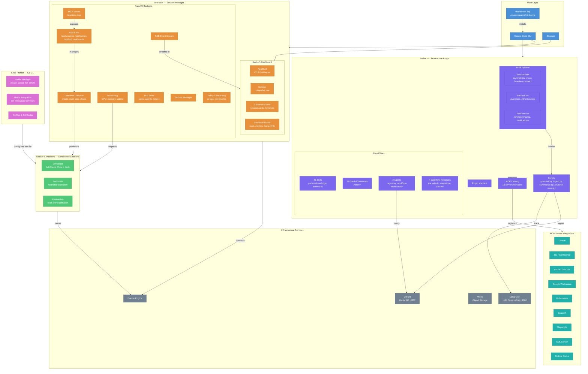
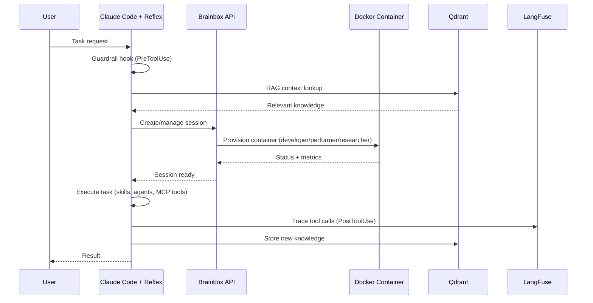

# ink-bunny Architecture Overview

## System Diagram

## Package Summary

| Package | Language | What It Does |
|---------|----------|-------------|
| **brainbox** | Python + Svelte | FastAPI backend + dashboard for managing sandboxed Claude Code sessions in Docker containers |
| **reflex** | Markdown + Bash/Python | Claude Code plugin — skills, commands, agents, workflow templates, hooks, and MCP catalog |
| **shell-profiler** | Go | CLI for managing workspace-specific environment profiles via direnv |
| **docker** | Dockerfile + Compose | Container images (3 roles) and infrastructure services (Qdrant, LangFuse, MinIO) |
| **docs** | Markdown | Three-phase architecture roadmap (Foundation → Hardened → Production) |

## Data Flow

## Distribution

All three packages ship via a single Homebrew tap (`neverprepared/ink-bunny`). Reflex is also available on the Claude Code plugin marketplace. Releases use scoped tags (`brainbox/vX.Y.Z`, `shell-profiler/vX.Y.Z`, `reflex/vX.Y.Z`).
