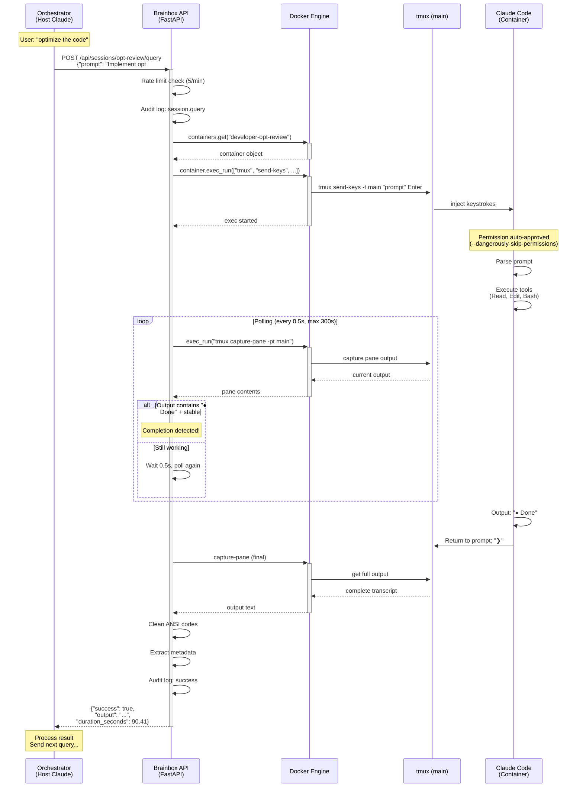
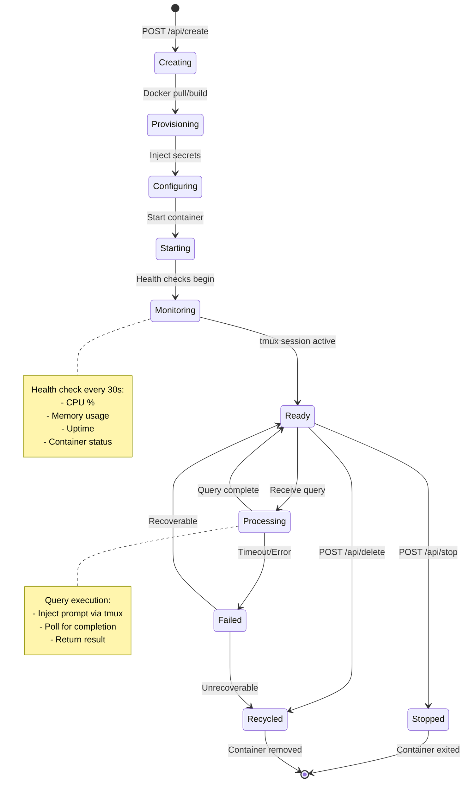
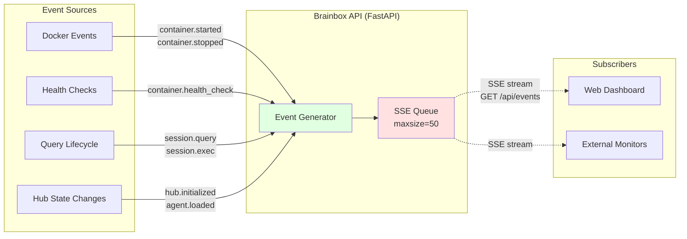
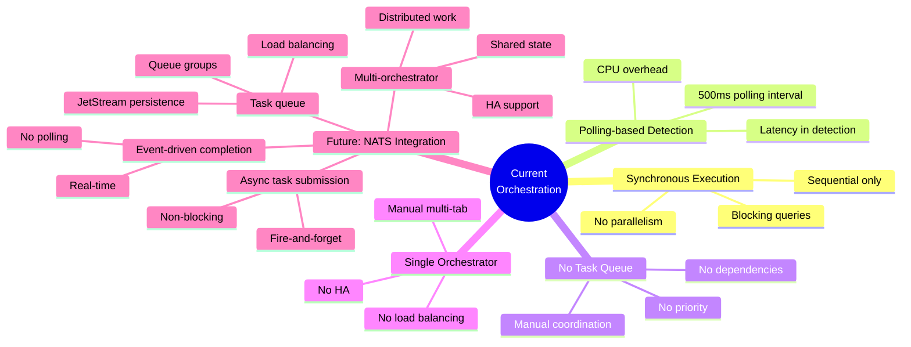
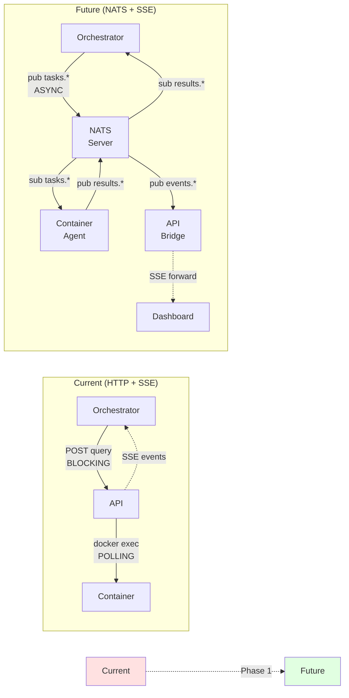
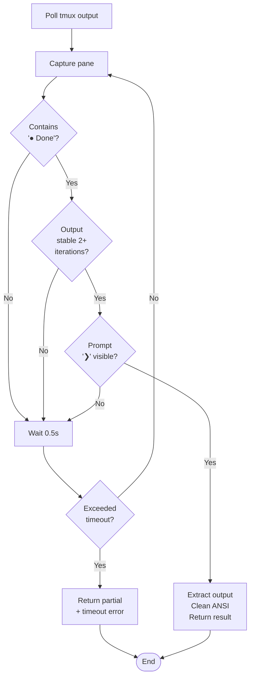
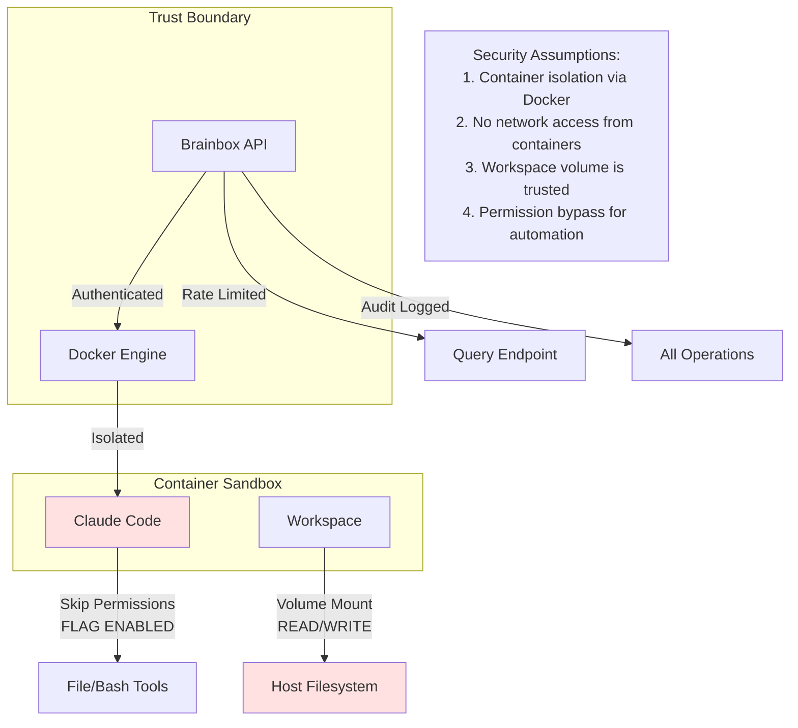

# Brainbox Orchestration Architecture

This document describes the current orchestration flow from host to container, including query execution, event streaming, and monitoring.

## System Overview

```mermaid
graph TB
    subgraph "Host Machine"
        Orchestrator[Claude Code<br/>Orchestrator]
        API[Brainbox API<br/>FastAPI :8000]
        Docker[Docker Engine]
        Dashboard[Web Dashboard<br/>Browser]
    end

    subgraph "Docker Container"
        Tmux[tmux session 'main']
        Claude[Claude Code CLI]
        FS[/home/developer/workspace<br/>Volume Mount]
    end

    Orchestrator -->|HTTP POST<br/>/api/sessions/*/query| API
    API -->|Docker API calls| Docker
    Docker -->|exec into container| Tmux
    Tmux -->|keystrokes via IPC| Claude

    API -.->|SSE events| Dashboard
    Docker -.->|health checks| API

    FS <-.->|bidirectional<br/>file sync| HostFS[Host Source Code]

    Claude -->|reads/writes| FS

    style Orchestrator fill:#e1f5ff
    style API fill:#fff4e1
    style Docker fill:#f0f0f0
    style Claude fill:#e1ffe1
    style Dashboard fill:#ffe1f5
```

## Query Execution Flow



## Container Lifecycle



## Event Streams (SSE)



## File System Synchronization

```mermaid
graph TB
    subgraph "Host"
        HostFS[/Users/.../code/ink-bunny]
        API[Brainbox API]
    end

    subgraph "Container"
        ContainerFS[/home/developer/workspace]
        Claude[Claude Code]
    end

    HostFS <-->|Docker Volume Mount<br/>Bidirectional Sync| ContainerFS

    Claude -->|Read files| ContainerFS
    Claude -->|Write/Edit files| ContainerFS

    ContainerFS -.->|Changes appear<br/>immediately| HostFS

    API -->|Git operations| HostFS

    Note1[Example: Optimizations written<br/>by container Claude appear<br/>on host for git commit]

    style HostFS fill:#e1f5ff
    style ContainerFS fill:#e1ffe1
```

## Current Limitations & Future Improvements



## NATS Migration Path



## Query API Details

### Request Format

```json
{
  "prompt": "Implement optimization #1",
  "working_dir": "/home/developer/workspace/brainbox",
  "timeout": 180,
  "fork_session": false
}
```

### Response Format

```json
{
  "success": true,
  "conversation_id": "optimization-review-1771168506",
  "output": "...Claude's full output...",
  "error": null,
  "exit_code": 0,
  "duration_seconds": 90.41,
  "files_modified": []
}
```

### Completion Detection Logic



## Performance Characteristics

| Metric | Current Value | Notes |
|--------|--------------|-------|
| Query Latency | ~500ms base + execution time | Docker exec + tmux overhead |
| Polling Interval | 500ms | Configurable, impacts CPU usage |
| Max Timeout | 300s (5 min) | Configurable per query |
| Rate Limit | 5 queries/min per session | Prevents abuse |
| SSE Event Delay | ~100ms | Near real-time |
| Health Check Interval | 30s | Container metrics |
| Max SSE Queue Size | 50 events | Drops old events if full |

## Security Model



## Next Steps

### Immediate Improvements (No NATS)
- [ ] Add `async=true` flag to query API
- [ ] Return task_id immediately for async queries
- [ ] Add `/api/sessions/{name}/tasks/{task_id}` status endpoint
- [ ] Emit SSE events: `query.{task_id}.started/completed`

### Phase 1: NATS Integration
- [ ] Add NATS server (embedded or sidecar)
- [ ] Implement NATS bridge in API
- [ ] Add container agent for NATS subscriptions
- [ ] Forward NATS events → SSE for dashboard

### Phase 2: Task Queue
- [ ] JetStream for persistent task queue
- [ ] Task dependencies (blockedBy/blocks)
- [ ] Priority scheduling
- [ ] Result aggregation

### Phase 3: Multi-Container Coordination
- [ ] Queue groups for load balancing
- [ ] Dynamic container scaling
- [ ] Workflow DAG execution
- [ ] High availability orchestrator

---

**Last Updated**: 2026-02-15
**Current Version**: Single orchestrator, synchronous queries, SSE events
**Next Milestone**: Async query API + task tracking
