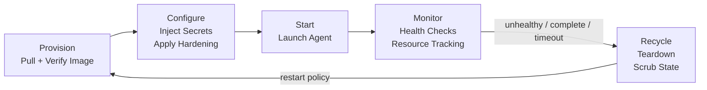
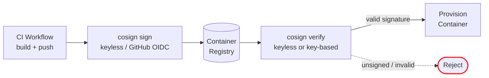
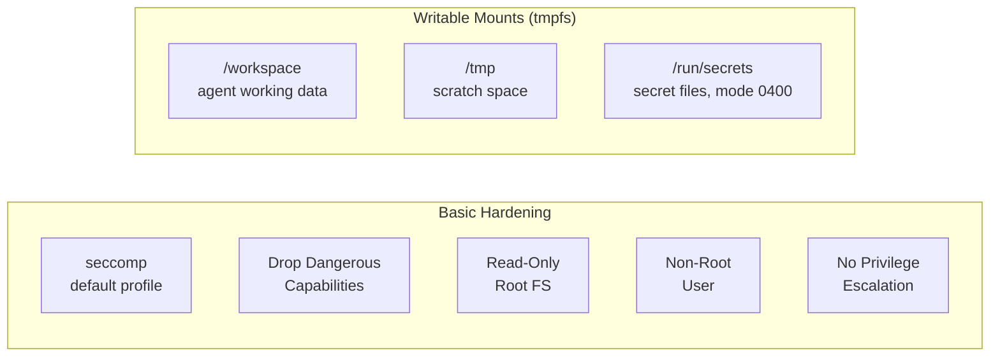

# Container Lifecycle

Every agent container follows a managed lifecycle. No container runs unbounded.



## Phases

| Phase | What Happens |
|---|---|
| **Provision** | Pull agent image, verify signature (cosign), allocate resources from Docker |
| **Configure** | Write secrets to tmpfs via [[arch-secrets-management|1Password + direnv]], apply hardening flags |
| **Start** | Launch the agent process inside the container |
| **Monitor** | Continuous health checks, resource usage tracking, heartbeat validation |
| **Recycle** | Teardown on completion, failure, or timeout — scrub ephemeral state, reclaim resources |

## Image Verification



**CI signing**: The Docker workflow signs all images (base + role variants) using Sigstore keyless cosign with GitHub OIDC identity. No key pair to manage — signatures are cryptographically tied to the GitHub Actions workflow via Fulcio certificates and recorded in the Rekor transparency log.

**Runtime verification**: Brainbox verifies image signatures during the Provision phase. Two strategies are supported:

| Strategy | Config | CLI flags |
|---|---|---|
| **Keyless** (preferred) | `CL_COSIGN__CERTIFICATE_IDENTITY` + `CL_COSIGN__OIDC_ISSUER` | `--certificate-identity-regexp` + `--certificate-oidc-issuer` |
| **Key-based** (fallback) | `CL_COSIGN__KEY` (path to PEM public key) | `--key` |

When both are configured, keyless takes precedence. The `CL_COSIGN__MODE` setting controls behavior:

| Mode | Behavior |
|---|---|
| `off` | Skip verification entirely |
| `warn` (default) | Log warning on failure, continue provisioning |
| `enforce` | Block provisioning on verification failure |

| Requirement | Phase 1 | Later Phases |
|---|---|---|
| **cosign signature** | Required | Required |
| **Vulnerability scan** | Not required | Required (reject critical CVEs) |
| **Base image** | Dev images with debugging tools permitted | Distroless/scratch only |
| **Shells / network tools** | Permitted (aids debugging) | Removed (reduces attack surface) |

## Container Hardening

Applied at the Configure phase to every container.



| Control | Setting | Purpose |
|---|---|---|
| **seccomp** | Docker default profile | Blocks most dangerous syscalls out of the box |
| **Capabilities** | Drop NET_RAW, SYS_ADMIN, MKNOD, SYS_CHROOT, NET_ADMIN | Removes ARP spoofing, mount manipulation, device creation |
| **Read-only rootfs** | `readOnlyRootFilesystem: true` | Prevents modification of container binaries |
| **Non-root user** | `runAsNonRoot: true`, `runAsUser: 65534` | Limits host impact on container escape |
| **No privilege escalation** | `--security-opt=no-new-privileges:true` | Blocks setuid/setgid escalation |
| **Secrets delivery** | File-based via tmpfs at `/run/secrets/<name>`, mode 0400 | Eliminates `/proc/*/environ` exposure |

### Docker Equivalent

```bash
docker run \
  --cap-drop NET_RAW --cap-drop SYS_ADMIN --cap-drop MKNOD \
  --cap-drop SYS_CHROOT --cap-drop NET_ADMIN \
  --security-opt no-new-privileges:true \
  --read-only \
  --tmpfs /workspace:size=500M \
  --tmpfs /tmp:size=100M \
  --mount type=tmpfs,destination=/run/secrets,tmpfs-mode=0400 \
  --user 65534:65534 \
  agent-image:latest
```

## Enforcement Boundaries

| Boundary | Purpose |
|---|---|
| **Resource Limits** | CPU, memory, ephemeral storage caps per container |
| **Egress Rules** | Allowlisted outbound destinations only |
| **Mount Policy** | No host filesystem mounts, no Docker socket |
| **Timeouts** | Every container has a maximum TTL — no indefinite execution |

## Lifecycle Rules

- **Restart policy** determines whether a recycled container re-provisions or terminates
- **Orphan reaping**: monitor phase detects containers with no active task and recycles them
- **State is ephemeral**: container filesystem is destroyed on recycle — durable outputs go to [[arch-shared-state|Shared State]]
