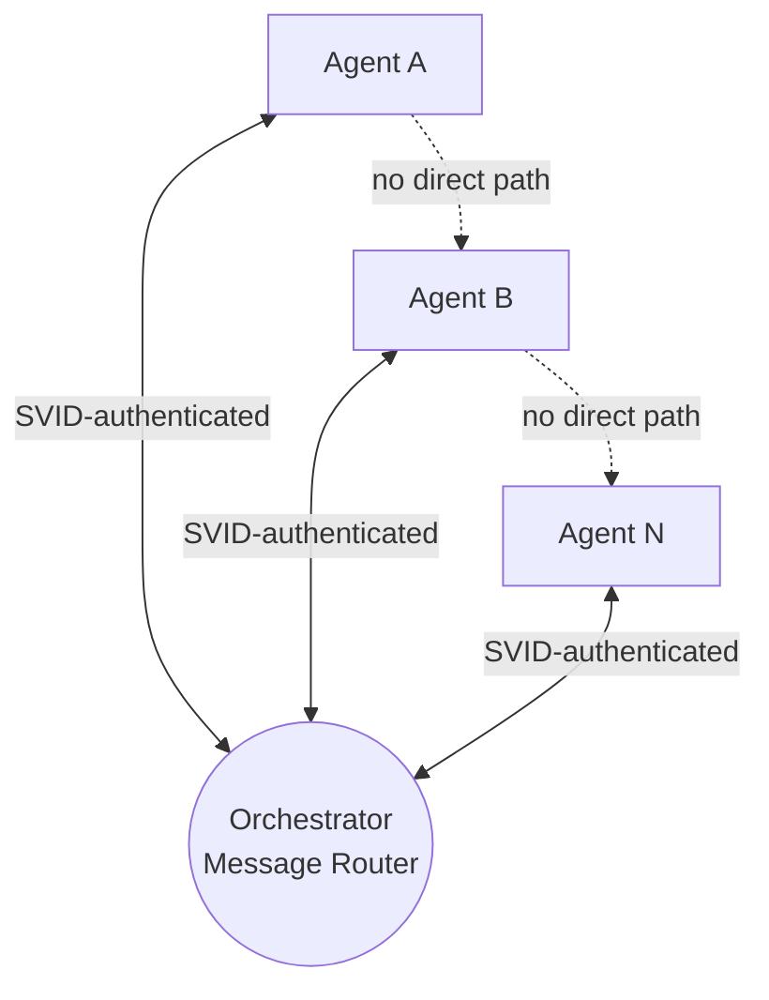
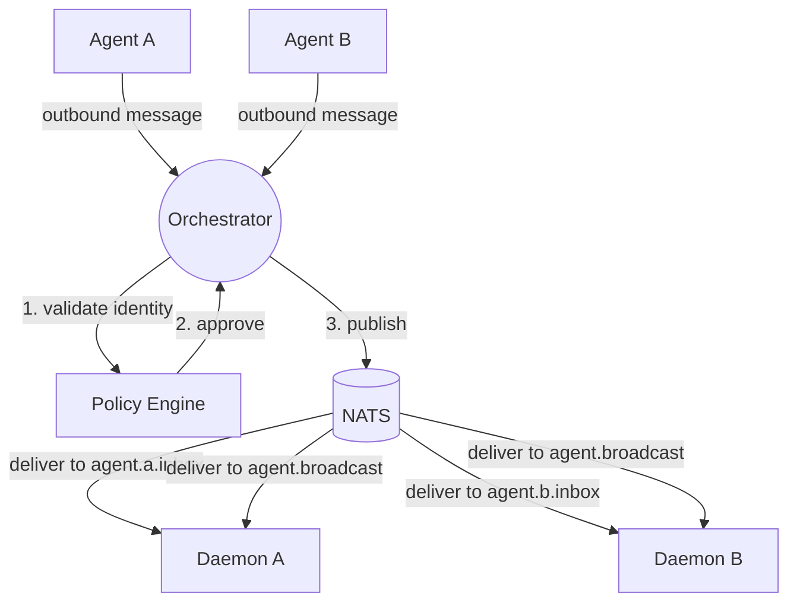
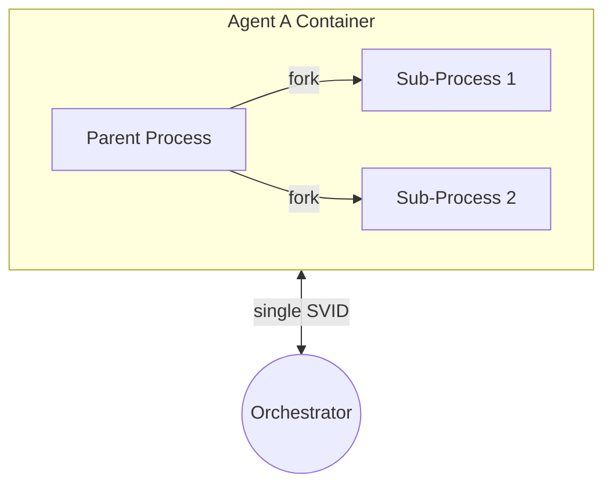
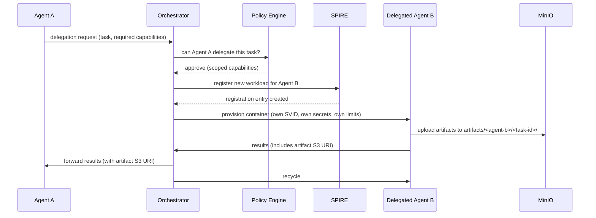
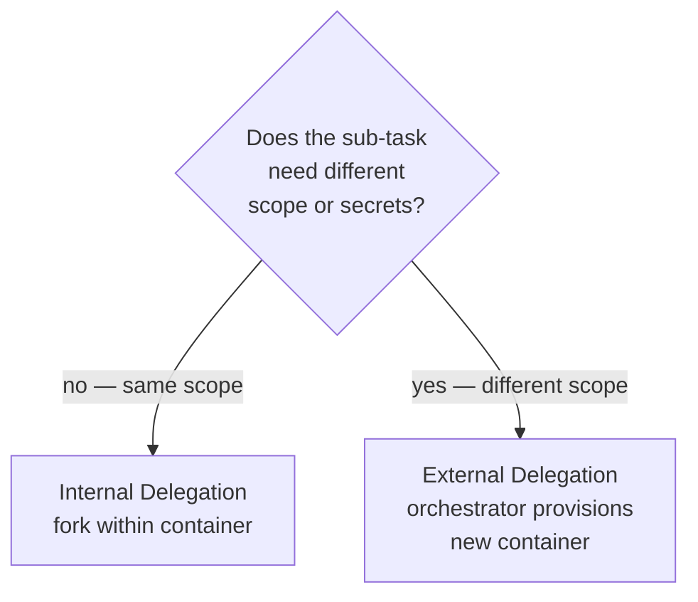

# Agent Communication

**New in PHASE_2.** Breaks out from PHASE_1's [[arch-orchestration|Orchestration]] page into its own page, adding external delegation (orchestrator provisions new containers for sub-tasks) and broadcast messaging.

All inter-agent communication flows through the orchestrator. NATS provides the message transport layer, but the orchestrator remains the single enforcement point — agents never publish directly to NATS. There are no direct agent-to-agent connections.

## Star Topology

Every message passes through the orchestrator, which validates identity (SVID), checks policy (OPA), logs the exchange, and routes to the recipient.

### Why Star Topology

| Benefit | Detail |
|---|---|
| **Single enforcement point** | All policy checks, identity validation, and logging happen in one place |
| **No agent discovery** | Agents don't need to find each other — they send messages to the orchestrator |
| **Simple networking** | Agents only need to reach the orchestrator — no mesh or service discovery |
| **Full visibility** | Every message is observable by default |

## Message Patterns

| Pattern | Description | Example |
|---|---|---|
| **Request / Reply** | Agent sends request, orchestrator routes it, recipient replies | Agent A requests data from Agent B |
| **Event** | Agent emits an event, orchestrator routes to subscribers | Agent A completed a task, notify interested agents |
| **Broadcast** | Orchestrator sends to all agents matching a filter | System-wide policy change notification |

## Message Transport: NATS

The star topology's enforcement model is unchanged — the orchestrator evaluates every message before delivery. NATS replaces in-memory routing as the transport mechanism between the orchestrator and agent daemons.

| Property | Detail |
|---|---|
| **Subject naming** | `agent.<name>.inbox` for directed messages, `agent.broadcast` for broadcasts |
| **Enforcement** | Messages are published to NATS subjects only after orchestrator policy evaluation — NATS is a delivery mechanism, not an autonomous bus |
| **Agent outbound** | Agents send all outbound messages to the orchestrator HTTP API — they never publish directly to NATS |
| **Fallback** | If NATS is unavailable, the orchestrator falls back to in-memory dict routing (see [[arch-orchestration#Circuit Breaker Fallback]]) |

This preserves the star topology's key properties: single enforcement point, full visibility, and no agent discovery needed. NATS changes how messages are delivered, not how they are authorized.

## Delegation

### Internal Delegation

An agent forks sub-processes within its own container. The orchestrator has no visibility.

| Property | Detail |
|---|---|
| **Scope** | Same container, same SVID, same resource limits |
| **Orchestrator visibility** | None — internal sub-processes are opaque |
| **Secret access** | Shared — sub-processes inherit the parent's `/run/secrets/` mount |

### External Delegation

An agent requests the orchestrator to provision a new container for a sub-task. The delegated agent gets its own SVID, secrets, and resource limits.

| Property | Detail |
|---|---|
| **Scope** | New container, new SVID, separate resource limits and secrets |
| **Orchestrator visibility** | Full — orchestrator provisions, monitors, and recycles the delegated container |
| **Capabilities** | Scoped by policy — delegated agent may have fewer capabilities than the parent |
| **Lifecycle** | Independent — delegated agent follows full [[arch-brainbox|container lifecycle]] |

### When to Use Which

## Agent Daemon Integration

The [[arch-orchestration#Agent Daemon|agent daemon]] inside each container is the concrete implementation of the star topology's agent-side endpoint. Each daemon:

1. Authenticates with the orchestrator using its container token
2. Polls for inbound messages and task assignments
3. Executes work via Claude Code CLI (respecting the container's LLM provider — Claude API or Ollama)
4. Posts results back through the message router

This means all four message patterns (request/reply, event, broadcast, delegation) flow through the daemon rather than requiring manual operator interaction in the container terminal.

## Communication Guardrails

Enforced at the orchestrator on every message, **before** publication to NATS. NATS is the delivery layer — all identity, policy, schema, and logging checks happen at the orchestrator before a message reaches the transport.

| Guardrail | How |
|---|---|
| **Identity required** | Every message must carry a valid SVID — unsigned messages rejected |
| **Policy check** | OPA evaluates whether this agent can send to that target (falls back to built-in rules if OPA unavailable) |
| **Schema validation** | Message payload must conform to the expected schema |
| **Logging** | Every routed message is logged to [[arch-observability|Observability]] with sender SVID, recipient, timestamp |
| **Rate limiting** | Per-agent message quotas enforced at the orchestrator |
| **Transport isolation** | Agents cannot access NATS directly — daemon subscribes via orchestrator-issued credentials, never publishes |
