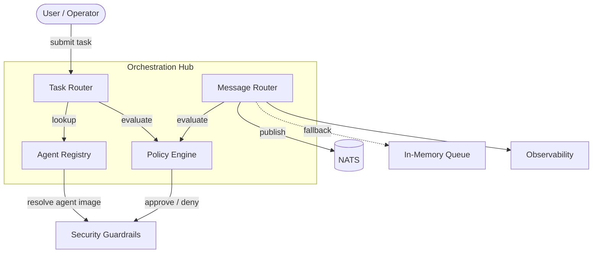
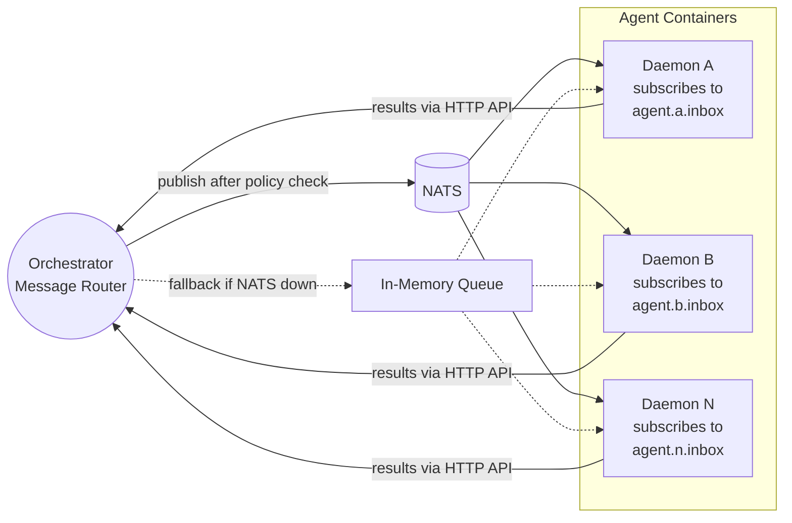
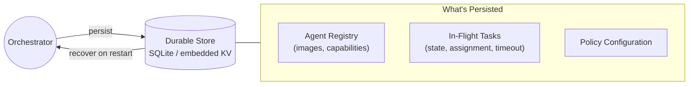
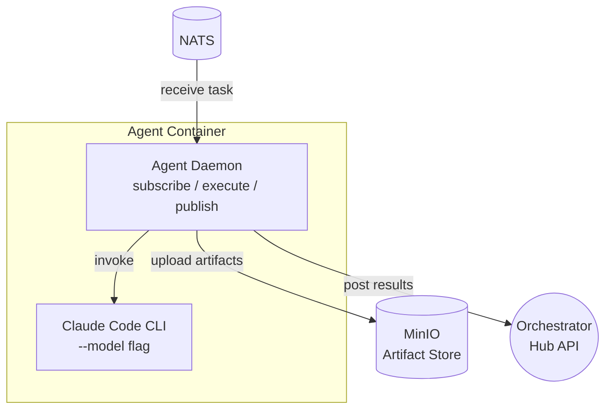
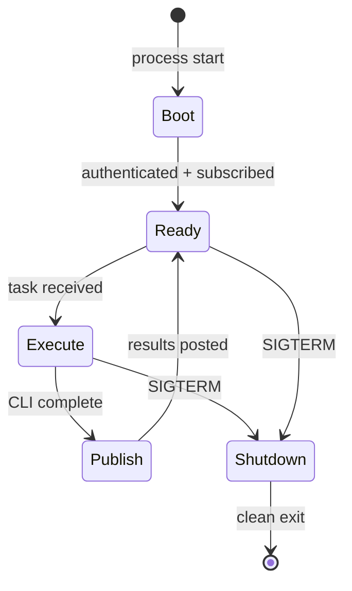
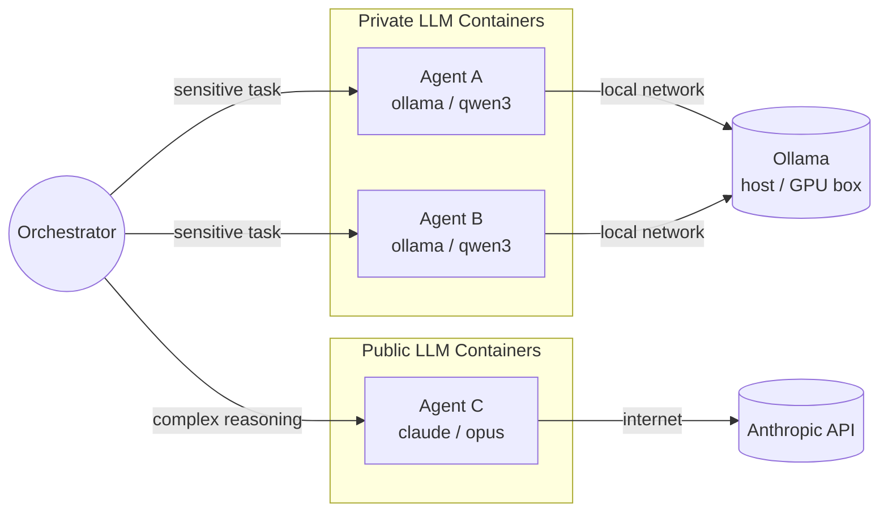

# Orchestration Layer

The orchestration hub serves two roles: **task dispatch** (routing work to agents) and **communication bus** (routing all agent-to-agent messages). NATS provides the message transport between the orchestrator and agent daemons, with circuit breaker fallback to in-memory routing when NATS is unavailable.

## Hub Overview

## Components

| Component | Responsibility |
|---|---|
| **Task Router** | Receives work requests from users, resolves which agent handles them |
| **Agent Registry** | Catalog of available agents, their capabilities, and container images |
| **Policy Engine** | Evaluates authorization for both task dispatch and agent-to-agent messages. Delegates to [[arch-security-tooling#OPA|OPA]] when enabled. |
| **Message Router** | Routes all inter-agent communication — request/reply, events, broadcasts. Publishes to NATS subjects after policy evaluation, falls back to in-memory routing when NATS is unavailable |

## Task Dispatch Flow

1. User submits a task
2. Task Router queries the Agent Registry for a capable agent
3. Policy Engine evaluates authorization (can this agent run? with what capabilities?)
4. On approval, the task is dispatched into the [[arch-security-guardrails|Security Guardrails]] layer

## Message Routing Flow

1. Agent sends a message (result, event, delegation request) to the orchestrator
2. Message Router validates the payload schema
3. Policy Engine checks scope (can this agent send this message to that target?)
4. Agent identity token (SVID) is verified
5. Message is logged to [[arch-observability|Observability]] and routed to the recipient

See [[arch-agent-communication]] for the full communication model, delegation patterns, and guardrails.

## NATS Message Bus

NATS replaces the in-memory `_pending` dict as the message transport between the orchestrator and agent daemons. The orchestrator remains the single enforcement point — NATS is a delivery mechanism, not an autonomous message bus.

| Property | Detail |
|---|---|
| **Subject naming** | `agent.<name>.inbox` for directed messages, `agent.broadcast` for broadcasts |
| **Publish flow** | Orchestrator evaluates policy → publishes to NATS subject → daemon receives |
| **Agent outbound** | Agents never publish directly to NATS — all outbound goes through orchestrator HTTP API first (preserves star topology for policy enforcement) |
| **Audit logging** | Orchestrator taps the NATS stream for audit logging before publish |
| **Policy evaluation** | Pre-publish gate — messages only reach NATS after passing OPA/built-in policy checks |

### Circuit Breaker Fallback

The orchestrator probes NATS health on startup and periodically. If NATS becomes unreachable, message routing degrades gracefully to in-memory delivery.

| State | Behavior |
|---|---|
| **NATS healthy** | Normal operation — messages published to NATS subjects |
| **NATS unreachable** | Circuit breaker opens — fall back to in-memory dict routing (Phase 1 behavior) |
| **NATS recovers** | Drain in-memory queue to NATS, resume normal routing |

Dashboard/SSE shows the current transport mode (NATS / in-memory fallback) so the operator has visibility into degraded state.

## State Persistence

The orchestrator persists critical state to survive restarts.

| Data | Persisted | Recovery |
|---|---|---|
| **Agent registry** | Yes | Rebuilt from config + registry on restart |
| **In-flight tasks** | Yes | Resumed or safely timed out on restart |
| **Policy config** | Yes | Loaded from version-controlled source on restart |
| **Message queue** | No | In-flight messages lost — agents retry via standard timeout |

## Degraded Mode

When the orchestrator detects internal failures, it enters a degraded read-only mode rather than crashing.

| Mode | Behavior |
|---|---|
| **Normal** | Full task dispatch, message routing, policy evaluation |
| **Degraded (read-only)** | No new task dispatch, no new container provisioning. Existing containers continue running. Message routing and health checks continue. Alerts operator. |
| **Offline** | Orchestrator unreachable. Existing containers continue until TTL. No new work. |

## Agent Daemon

Each container runs a lightweight agent daemon that connects it to the orchestrator's task and message infrastructure. Without the daemon, containers are interactive-only — an operator must manually drive work through the terminal. The daemon enables programmatic task execution.

### Daemon Responsibilities

| Responsibility | Detail |
|---|---|
| **Message subscription** | Subscribe to NATS subject `agent.<name>.inbox` for assigned work (falls back to polling `/api/hub/messages` when NATS unavailable) |
| **Task execution** | Invoke Claude Code CLI with the task prompt, capture output |
| **Artifact publishing** | Upload output (markdown, code, logs) to MinIO bucket `artifacts/<agent-name>/<task-id>/` |
| **Result reporting** | Post `task.completed` to the hub via `/api/hub/messages` with artifact S3 URI in payload |
| **Health signaling** | Emit heartbeat events so the orchestrator knows the daemon is alive |
| **Graceful shutdown** | On SIGTERM, finish current task, post partial results, unsubscribe from NATS, exit cleanly |

### Daemon Lifecycle

The daemon runs as a supervised process alongside ttyd (systemd unit or supervisor).

1. **Boot** — authenticates with hub using container token, subscribes to NATS subject `agent.<name>.inbox`
2. **Ready** — enters message loop, waiting for task assignments
3. **Execute** — receive message → parse task → invoke Claude CLI → capture output
4. **Publish** — upload artifacts to MinIO bucket → post `task.completed` with S3 URI to hub
5. **Shutdown** — on SIGTERM, finish current task, post partial results, unsubscribe, exit

### LLM Provider Routing

The daemon inherits the container's LLM configuration. The orchestrator decides which LLM backend a container uses at provision time, not at task time.

| Routing Scenario | Provider | Rationale |
|---|---|---|
| **Sensitive code / proprietary data** | Ollama (private) | Data stays on the local network |
| **Complex reasoning / large context** | Claude (public) | Stronger model capabilities |
| **Mixed workload** | Both | Orchestrator routes by task sensitivity label |
| **Cost optimization** | Ollama (private) | No per-token API costs for bulk work |

### Practical Use Cases

| Use Case | How It Works |
|---|---|
| **Isolation boundaries** | Different containers get different secrets, network policies, and roles — a researcher container can't write to production, a performer can |
| **Persistent long-running work** | An agent works on a codebase for hours with full state (git history, installed deps) — subagents are ephemeral, containers persist |
| **Mixed LLM backends** | Sensitive repo in a private Ollama container, complex analysis on Claude API — orchestrator routes by sensitivity |
| **Role-specific tooling** | Developer has full git, performer has cloud CLIs, researcher has Qdrant — each container is purpose-built |

## Basic Monitoring

| Check | Action on Failure |
|---|---|
| **Orchestrator health endpoint** | If unreachable, alert operator |
| **Task throughput** | If zero tasks dispatched for configurable window, alert operator |
| **Container orphan scan** | If containers exist with no matching orchestrator task record, alert + recycle |
