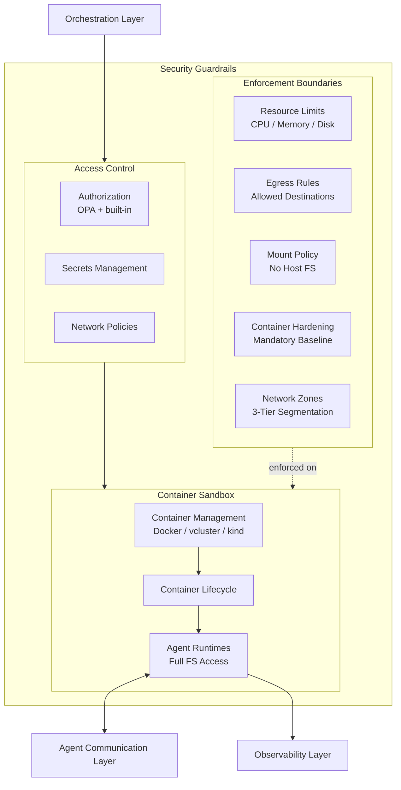
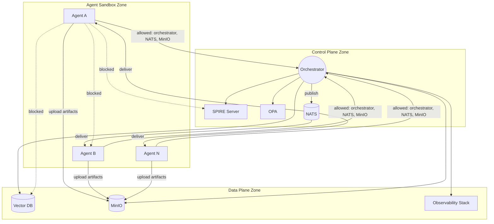

# Security Guardrails

**New in PHASE_2.** Breaks out from PHASE_1's [[arch-brainbox|Brainbox Lifecycle]] page into its own page, adding three-zone network segmentation, default-deny policies, and OPA-backed authorization.

The core security boundary. Everything inside runs in containers — agents get **full filesystem autonomy within their container** but have zero access to the host.

## Access Control

| Control | Purpose |
|---|---|
| **Authorization** | OPA evaluates policy decisions, orchestrator built-in rules as fallback — see [[arch-security-tooling#OPA]] |
| **Secrets Management** | Envelope encryption, file-based delivery — see [[arch-secrets-management]] |
| **Network Policies** | Restrict egress to approved destinations, enforce zone boundaries |

## Network Zones

Platform components are segmented into three zones with default-deny between them.

| Zone | Contains | Inbound From | Outbound To |
|---|---|---|---|
| **Agent Sandbox** | All agent containers | Orchestrator (task dispatch), NATS (message delivery) | Orchestrator (results), NATS (subscribe only), MinIO (artifact upload), allowlisted external APIs |
| **Control Plane** | Orchestrator, SPIRE Server, OPA, NATS | Agent zone (requests), Data zone (responses) | Data zone (store/query), Agent zone (dispatch), NATS (publish) |
| **Data Plane** | Vector DB, MinIO, Observability | Control plane (via shared state proxy), Agent zone (MinIO artifact uploads via proxy) | Control plane (query responses), External (MinIO webhook notifications → n8n/Jenkins) |

### Agent-to-Agent Isolation

| Rule | Detail |
|---|---|
| **Default-deny NetworkPolicy** | All agent containers start with deny-all ingress and egress |
| **Egress allowlist** | Orchestrator port, NATS (subscribe only), MinIO (artifact upload), and explicitly approved external destinations |
| **NATS access** | Agents can subscribe to their inbox subject via daemon — cannot access NATS admin endpoints or publish directly |
| **MinIO access** | Agents can upload artifacts via daemon — cannot access MinIO admin console or other agents' buckets |
| **Webhook egress** | MinIO → external pipeline endpoints (n8n/Jenkins) allowed from Data Plane zone only |
| **No CAP_NET_RAW** | Dropped in mandatory hardening — prevents ARP spoofing on shared bridge networks |
| **No CAP_NET_ADMIN** | Dropped in mandatory hardening — prevents network configuration manipulation |

## Enforcement Boundaries

| Boundary | Purpose |
|---|---|
| **Resource Limits** | CPU, memory, ephemeral storage caps per agent container |
| **Egress Rules** | Allowlisted outbound destinations only |
| **Mount Policy** | No host filesystem mounts, no Docker socket, no container runtime sockets |
| **Brainbox Hardening** | Full mandatory baseline — see [[arch-brainbox#Mandatory Brainbox Hardening]] |
| **Network Zones** | Three-zone segmentation with default-deny between zones |

### Mandatory Brainbox Hardening

| Control | Setting |
|---|---|
| seccomp | Custom restrictive profile |
| Capabilities | Drop ALL |
| Root filesystem | Read-only |
| User | Non-root (UID 65534) |
| Privilege escalation | Blocked |
| AppArmor | Custom deny profile |
| Secrets | File-based on tmpfs, not env vars |
| SPIRE sidecar | Separate container, shared Unix socket only |
| PID namespace | Not shared between containers |

## Container Management

| Tool | Use Case |
|---|---|
| **Docker** | Single-agent containers, lightweight tasks |
| **vcluster** | Virtual Kubernetes clusters for multi-agent workloads |
| **kind** | Local K8s clusters for development and testing |

See [[arch-brainbox]] for the full container lifecycle detail.
