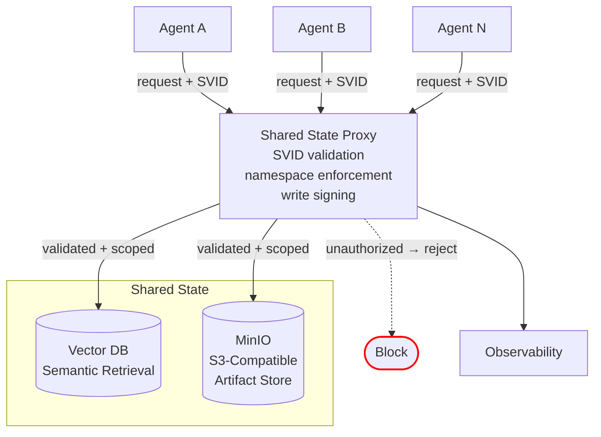
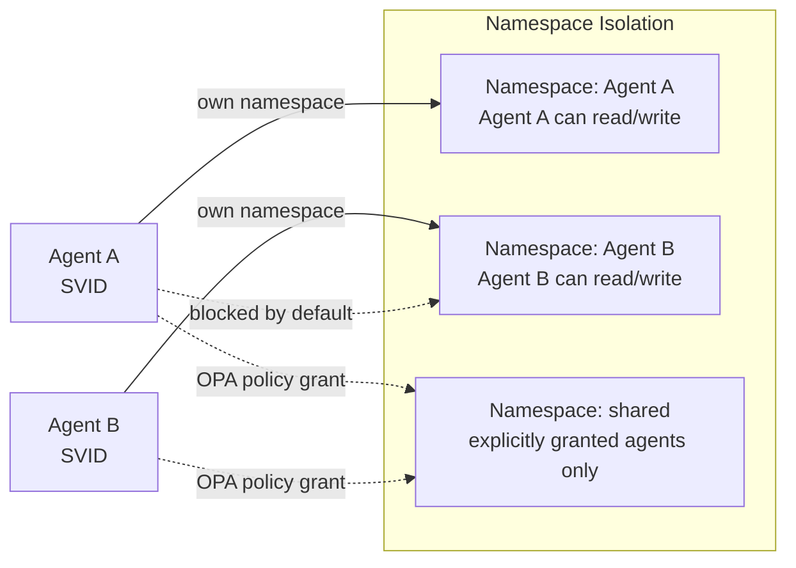
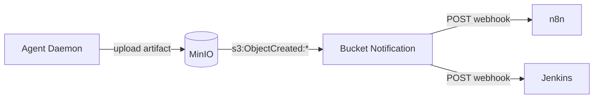

# Shared State

Durable persistence layer for cross-agent data. The only sanctioned path for data that outlives a single container. All access is authenticated, scoped, and audited.

## Architecture

Agents never access stores directly. All reads and writes go through an authenticated proxy that enforces namespace isolation and validates SVIDs.

## Stores

| Store | Purpose | Examples |
|---|---|---|
| **Vector DB** | Semantic search and retrieval across agent workloads | Embeddings, conversation history, knowledge base |
| **MinIO (S3-Compatible)** | Durable, addressable outputs from agent tasks | Generated files, reports, build artifacts, datasets |

### MinIO Artifact Store

MinIO provides the concrete S3-compatible artifact store. Self-hosted, already running in the home lab.

| Property | Detail |
|---|---|
| **Access protocol** | S3 API via boto3/minio-py through the shared state proxy |
| **Bucket structure** | `artifacts/<agent-name>/<task-id>/<filename>` |
| **Access control** | MinIO bucket policies scoped per-agent (enforced via proxy) |
| **Retention** | Configurable per-bucket lifecycle rules |
| **Agent upload flow** | Daemon uploads via S3 API after task execution → posts `task.completed` with S3 URI to hub |

## Access Control

### Namespace Isolation

Each agent (or task) operates in a scoped namespace. Cross-namespace access requires explicit policy.

| Rule | Detail |
|---|---|
| **Default: own namespace only** | Agents can read/write only data in their own namespace |
| **Cross-namespace reads** | Require explicit OPA policy grant based on SVID identity |
| **Shared namespace** | Opt-in space for cross-agent data — requires policy approval |
| **Vector DB tenant isolation** | Collections scoped per namespace — queries cannot cross boundaries without policy |
| **MinIO path isolation** | Artifacts stored under `artifacts/<namespace>/<task-id>/` — proxy enforces S3 prefix boundaries |

### Write Integrity

Every write includes a cryptographic signature for tamper detection.

| Control | Detail |
|---|---|
| **Signed writes** | Each write includes a signature over the content hash using the agent's SVID |
| **Attribution** | Every stored object carries: originating SVID, task ID, timestamp, content hash |
| **Verified reads** | Consuming agents verify the signature before processing — unsigned or invalid artifacts are rejected |

## Pipeline Integration

MinIO native bucket notifications deliver artifacts to downstream pipelines without custom webhook code.

### Webhook Push via Bucket Notifications

| Property | Detail |
|---|---|
| **Trigger** | MinIO fires on `s3:ObjectCreated:*` events |
| **Delivery** | POST to configured webhook endpoints (n8n, Jenkins, or any HTTP target) |
| **Payload** | Bucket, key, size, content-type — standard S3 notification format |
| **Multiple targets** | n8n AND Jenkins (or others) can receive the same notification simultaneously |
| **No custom code** | MinIO handles delivery and retry natively — no webhook infrastructure to build |

### Delivery Guarantees

| Guarantee | Detail |
|---|---|
| **Retry** | MinIO retries failed webhook deliveries (configurable retry count and interval) |
| **Idempotency** | Downstream consumers must be idempotent — MinIO may retry on timeout |
| **Queue on failure** | If all targets are down, notifications queue in MinIO until recovery |

## Rules

- Container filesystems are **ephemeral** — anything that must survive a recycle goes here
- Agents access stores only through the authenticated proxy, never via direct filesystem mounts
- All writes are signed and attributed to the originating SVID
- All reads verify signatures before processing
- Cross-namespace access requires explicit OPA policy
- Data retention and classification governed by [[arch-observability#Data Classification]]

## What's Deferred

| Feature | Phase |
|---|---|
| Quarantine (flag compromised SVID data as untrusted) | PHASE_3 |
| Per-namespace encryption at rest | PHASE_3 |
| Integrity background scans | PHASE_3 |
| Downstream notification on quarantine | PHASE_3 |
