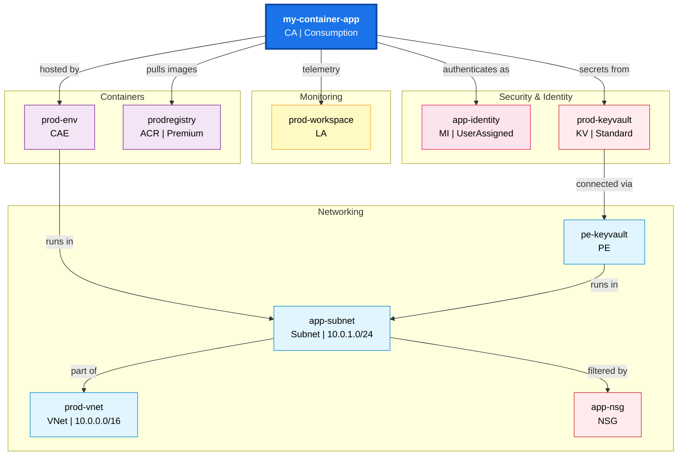
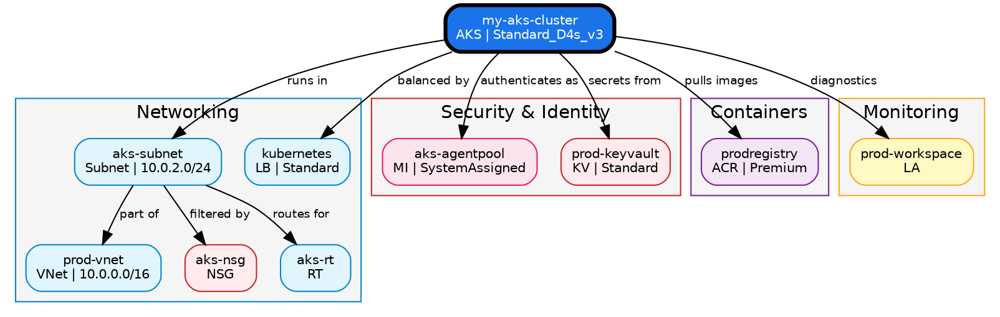

# Azure Resource Discovery

Patterns for tracing Azure resource dependencies, mapping networking and security topology, and generating architecture diagrams.

**SAFETY: All discovery operations are strictly READ-ONLY. NEVER execute `az` commands that create, modify, or delete resources. Only use `show`, `list`, `get`, and `query` operations. This skill is for observation and documentation only.**

## When to Use

- Tracing all dependencies of a specific Azure resource (networking, security, identity, monitoring)
- Documenting how a container app, VM, AKS cluster, or other resource connects to its environment
- Generating topology diagrams showing resource relationships
- Auditing networking and security configuration (VNets, NSGs, private endpoints)

## Prerequisites

- **Azure CLI** (`az`) installed and authenticated (`az login`)
- **Reader** role (minimum) on the target subscription or resource group
- **Azure Resource Graph** extension: required for `az graph query`. Usually auto-installed on first use; if not, the user must run `az extension add --name resource-graph`
- **Graphviz** (optional): `dot` command for rendering complex topologies. Install via `brew install graphviz` (macOS) or `apt install graphviz` (Linux). Falls back to Mermaid if not available.

## Query Guidelines

**IMPORTANT: Use the exact query templates below. Do NOT improvise Resource Graph KQL syntax.** Azure Resource Graph uses a subset of Kusto Query Language with restrictions that differ from full KQL. Improvised queries frequently produce `InvalidQuery` errors.

When you need filtering beyond what the templates cover, prefer `az resource list` with JMESPath `--query` over crafting new Resource Graph queries:

```bash
# GOOD: Use az resource list with JMESPath for simple filtering
az resource list --resource-group "<rg>" --query "[?type!='Microsoft.App/containerApps']" -o json

# BAD: Do NOT improvise Resource Graph KQL operators
# az graph query -q "resources | where type !in~ ('microsoft.app/containerapps')"  <-- will fail
```

### KQL Operators Reference (Resource Graph subset)

Only use these operators in `az graph query` — other KQL operators may not be supported:

| Operator | Example | Notes |
|----------|---------|-------|
| `=~` | `where name =~ 'myapp'` | Case-insensitive equals |
| `==` | `where name == 'myApp'` | Case-sensitive equals |
| `!=` | `where type != 'Microsoft.Web/sites'` | Case-sensitive not equals |
| `!~` | `where type !~ 'microsoft.web/sites'` | Case-insensitive not equals |
| `contains` | `where type contains 'network'` | Case-insensitive substring |
| `!contains` | `where type !contains 'network'` | Case-insensitive not-contains |
| `startswith` | `where name startswith 'prod'` | Case-insensitive prefix |
| `and` / `or` | `where type =~ 'x' and resourceGroup =~ 'y'` | Logical operators |
| `project` | `| project name, type, location` | Select columns |
| `mv-expand` | `| mv-expand x = properties.arr` | Expand arrays |

**Do NOT use:** `!in~`, `!has`, `has`, `in~` with inline lists, `matches regex`, or other advanced KQL operators — they are unreliable in Resource Graph.

## Resource Graph Query Templates

Use these exact templates. Replace only the placeholder values in angle brackets.

### Find Resource by Name

```bash
az graph query -q "resources | where name =~ '<resource-name>'" --first 10 -o json
```

### Find Resource with Subscription Filter

```bash
az graph query -q "resources | where name =~ '<resource-name>'" --subscriptions "<subscription-id>" --first 10 -o json
```

### Find Private Endpoints for a Resource

```bash
az graph query -q "resources | where type =~ 'microsoft.network/privateendpoints' | mv-expand conn = properties.privateLinkServiceConnections | where conn.properties.privateLinkServiceId =~ '<resource-id>'" --first 50 -o json
```

### Find NSGs in a Resource Group

```bash
az graph query -q "resources | where type =~ 'microsoft.network/networksecuritygroups' and resourceGroup =~ '<resource-group>'" --first 20 -o json
```

### Find Resources in a Resource Group (excluding a type)

```bash
# Use az resource list with JMESPath — more reliable than Resource Graph for exclusion filters
az resource list --resource-group "<rg>" --query "[?type!='<type-to-exclude>']" -o json
```

### Find Managed Identity Role Assignments

```bash
az role assignment list --assignee "<principal-id>" -o json
```

### Find Resources by Tag

```bash
az graph query -q "resources | where tags['<tag-key>'] =~ '<tag-value>'" --first 50 -o json
```

## Dependency Tracers by Resource Type

Each tracer lists the `az` CLI commands to execute. Commands that fail (permission denied, resource not found) should be noted in the trace output but should not halt the overall trace.

---

### Container App Tracer

**Target type:** `Microsoft.App/containerApps`

**Key dependencies:** Container App Environment, VNet/Subnet, NSG, ACR, Managed Identity, Key Vault, Log Analytics, Private Endpoints

#### Commands

```bash
# 1. Get container app details (includes identity, ingress, registry, secrets)
az containerapp show --name "<name>" --resource-group "<rg>" -o json

# 2. Get the Container App Environment
az containerapp env show --name "<env-name>" --resource-group "<env-rg>" -o json
# Extract: vnetConfiguration.infrastructureSubnetId, appLogsConfiguration.logAnalyticsConfiguration.customerId

# 3. Get VNet and Subnet from environment's subnet ID
az network vnet subnet show --ids "<subnet-id>" -o json
# Extract: addressPrefix, networkSecurityGroup.id, routeTable.id

# 4. Get the parent VNet
az network vnet show --ids "<vnet-id>" -o json
# Extract: addressSpace.addressPrefixes, subnets

# 5. Get NSG rules (if NSG attached to subnet)
az network nsg show --ids "<nsg-id>" -o json
az network nsg rule list --nsg-name "<nsg-name>" --resource-group "<nsg-rg>" -o json

# 6. Get ACR (from container image registry)
# Parse registry from container image field (e.g., myacr.azurecr.io/app:tag → myacr)
az acr show --name "<acr-name>" -o json

# 7. Get managed identity details
# If systemAssigned: principal ID is in the containerapp show output
# If userAssigned: get each identity
az identity show --ids "<user-assigned-identity-id>" -o json

# 8. Get role assignments for the managed identity
az role assignment list --assignee "<principal-id>" --all -o json

# 9. Get Key Vault references (from secrets in containerapp show output)
# Parse Key Vault URI from secret references (e.g., https://myvault.vault.azure.net/secrets/...)
az keyvault show --name "<vault-name>" -o json

# 10. Get Log Analytics workspace (from environment's log config)
az monitor log-analytics workspace show --workspace-name "<workspace-name>" --resource-group "<la-rg>" -o json

# 11. Find private endpoints targeting this resource
az graph query -q "resources | where type =~ 'microsoft.network/privateendpoints' | mv-expand conn = properties.privateLinkServiceConnections | where conn.properties.privateLinkServiceId =~ '<container-app-id>'" --first 20 -o json

# 12. Get diagnostic settings
az monitor diagnostic-settings list --resource "<container-app-id>" -o json
```

---

### Virtual Machine Tracer

**Target type:** `Microsoft.Compute/virtualMachines`

**Key dependencies:** NIC, VNet/Subnet, NSG, Public IP, Disks, Load Balancer, Availability Set, VM Extensions

#### Commands

```bash
# 1. Get VM details (includes identity, OS, hardware profile)
az vm show --name "<name>" --resource-group "<rg>" -o json
# Extract: networkProfile.networkInterfaces, storageProfile.osDisk, storageProfile.dataDisks,
#          identity, availabilitySet, hardwareProfile.vmSize

# 2. Get each NIC
az network nic show --ids "<nic-id>" -o json
# Extract: ipConfigurations[].subnet.id, ipConfigurations[].publicIPAddress.id,
#          networkSecurityGroup.id, ipConfigurations[].loadBalancerBackendAddressPools

# 3. Get subnet from NIC
az network vnet subnet show --ids "<subnet-id>" -o json
# Extract: addressPrefix, networkSecurityGroup.id, routeTable.id

# 4. Get parent VNet
az network vnet show --ids "<vnet-id>" -o json

# 5. Get NSG (from NIC or subnet)
az network nsg show --ids "<nsg-id>" -o json
az network nsg rule list --nsg-name "<nsg-name>" --resource-group "<nsg-rg>" -o json

# 6. Get public IP (if assigned)
az network public-ip show --ids "<pip-id>" -o json
# Extract: ipAddress, publicIPAllocationMethod, dnsSettings

# 7. Get load balancer (if NIC is in a backend pool)
az network lb show --ids "<lb-id>" -o json
# Extract: frontendIPConfigurations, backendAddressPools, loadBalancingRules

# 8. Get OS disk and data disks
az disk show --ids "<disk-id>" -o json
# Extract: diskSizeGb, sku.name, encryption

# 9. Get availability set (if configured)
az vm availability-set show --ids "<avset-id>" -o json

# 10. Get VM extensions
az vm extension list --vm-name "<name>" --resource-group "<rg>" -o json

# 11. Get managed identity role assignments
az role assignment list --assignee "<principal-id>" --all -o json

# 12. Get diagnostic settings
az monitor diagnostic-settings list --resource "<vm-id>" -o json

# 13. Find private endpoints in the same subnet
az graph query -q "resources | where type =~ 'microsoft.network/privateendpoints' | mv-expand subnet = properties.subnet | where subnet.id =~ '<subnet-id>'" --first 20 -o json
```

---

### AKS Cluster Tracer

**Target type:** `Microsoft.ContainerService/managedClusters`

**Key dependencies:** VNet/Subnet, NSG, ACR, Managed Identity, Key Vault, Load Balancer, Log Analytics, MC_ resource group, Private DNS

#### Commands

```bash
# 1. Get AKS cluster details
az aks show --name "<name>" --resource-group "<rg>" -o json
# Extract: agentPoolProfiles[].vnetSubnetID, networkProfile, identity,
#          addonProfiles, nodeResourceGroup, privateFqdn, apiServerAccessProfile

# 2. Get the MC_ (managed/node) resource group resources
az resource list --resource-group "<nodeResourceGroup>" -o json
# This contains load balancers, public IPs, route tables, NSGs managed by AKS

# 3. Get VNet and Subnet (from agent pool subnet ID)
az network vnet subnet show --ids "<subnet-id>" -o json
az network vnet show --ids "<vnet-id>" -o json

# 4. Get NSG (from subnet or MC_ resource group)
az network nsg show --ids "<nsg-id>" -o json
az network nsg rule list --nsg-name "<nsg-name>" --resource-group "<nsg-rg>" -o json

# 5. Get load balancer (from MC_ resource group)
az network lb list --resource-group "<nodeResourceGroup>" -o json

# 6. Get ACR attachment (check role assignments for acrPull)
az role assignment list --assignee "<aks-identity-principal-id>" --role acrpull --all -o json
# Parse ACR resource ID from scope field

# 7. Get ACR details
az acr show --name "<acr-name>" -o json

# 8. Get managed identity details
az identity show --ids "<kubelet-identity-id>" -o json
az role assignment list --assignee "<kubelet-principal-id>" --all -o json

# 9. Get Key Vault (from addon profiles — azureKeyvaultSecretsProvider)
# Parse Key Vault name from addon config if present
az keyvault show --name "<vault-name>" -o json

# 10. Get Log Analytics workspace (from addon profiles — omsagent)
# Parse workspace ID from omsagent addon config
az monitor log-analytics workspace show --ids "<workspace-id>" -o json

# 11. Get private DNS zone (for private clusters)
az network private-dns zone list --resource-group "<nodeResourceGroup>" -o json

# 12. Get route table (from subnet)
az network route-table show --ids "<route-table-id>" -o json

# 13. Get diagnostic settings
az monitor diagnostic-settings list --resource "<aks-id>" -o json
```

---

### App Service Tracer

**Target type:** `Microsoft.Web/sites` (where kind does NOT contain `functionapp`)

**Key dependencies:** App Service Plan, VNet integration, Private Endpoints, Key Vault refs, Managed Identity, App Insights, Database connections

#### Commands

```bash
# 1. Get web app details
az webapp show --name "<name>" --resource-group "<rg>" -o json
# Extract: serverFarmId, identity, httpsOnly, kind, state

# 2. Get App Service Plan
az appservice plan show --ids "<server-farm-id>" -o json
# Extract: sku, numberOfWorkers, reserved (Linux), zoneRedundant

# 3. Get app settings (contains connection strings, Key Vault refs, App Insights key)
az webapp config appsettings list --name "<name>" --resource-group "<rg>" -o json
# Look for: APPINSIGHTS_INSTRUMENTATIONKEY, APPLICATIONINSIGHTS_CONNECTION_STRING,
#           @Microsoft.KeyVault(...) references, *CONNSTR*, *DATABASE*, *REDIS*

# 4. Get connection strings
az webapp config connection-string list --name "<name>" --resource-group "<rg>" -o json

# 5. Get VNet integration
az webapp vnet-integration list --name "<name>" --resource-group "<rg>" -o json
# Extract: vnetResourceId, subnetResourceId

# 6. Get subnet and VNet (from VNet integration)
az network vnet subnet show --ids "<subnet-id>" -o json
az network vnet show --ids "<vnet-id>" -o json

# 7. Find private endpoints targeting this app
az graph query -q "resources | where type =~ 'microsoft.network/privateendpoints' | mv-expand conn = properties.privateLinkServiceConnections | where conn.properties.privateLinkServiceId =~ '<webapp-id>'" --first 20 -o json

# 8. Get Key Vault (from @Microsoft.KeyVault references in app settings)
az keyvault show --name "<vault-name>" -o json

# 9. Get App Insights (from instrumentation key or connection string)
az monitor app-insights component show --resource-group "<rg>" -o json
# Match by instrumentationKey

# 10. Get managed identity role assignments
az role assignment list --assignee "<principal-id>" --all -o json

# 11. Get diagnostic settings
az monitor diagnostic-settings list --resource "<webapp-id>" -o json

# 12. Get custom domains and SSL bindings
az webapp config hostname list --webapp-name "<name>" --resource-group "<rg>" -o json
az webapp config ssl list --resource-group "<rg>" -o json
```

---

### Function App Tracer

**Target type:** `Microsoft.Web/sites` (where kind contains `functionapp`)

**Key dependencies:** Same as App Service + Event Hub/Service Bus triggers, Storage Account

#### Commands

Run all App Service Tracer commands above, plus:

```bash
# 1. Get function app details (superset of webapp show)
az functionapp show --name "<name>" --resource-group "<rg>" -o json

# 2. Get app settings (look for trigger bindings)
az functionapp config appsettings list --name "<name>" --resource-group "<rg>" -o json
# Additional keys to look for:
#   AzureWebJobsStorage — linked Storage Account
#   AzureWebJobsEventHub*, EventHubConnection* — Event Hub triggers
#   AzureWebJobsServiceBus*, ServiceBusConnection* — Service Bus triggers
#   AzureWebJobsDashboard — diagnostic storage

# 3. Get Storage Account (from AzureWebJobsStorage)
# Parse account name from connection string or setting
az storage account show --name "<storage-account-name>" -o json

# 4. Get Event Hub namespace (from trigger connection string)
az eventhubs namespace show --name "<namespace>" --resource-group "<eh-rg>" -o json

# 5. Get Service Bus namespace (from trigger connection string)
az servicebus namespace show --name "<namespace>" --resource-group "<sb-rg>" -o json
```

---

### Generic Tracer

**Target type:** Any resource type not covered by the tracers above

#### Commands

```bash
# 1. Get full resource details
az resource show --ids "<resource-id>" -o json

# 2. Find private endpoints targeting this resource
az graph query -q "resources | where type =~ 'microsoft.network/privateendpoints' | mv-expand conn = properties.privateLinkServiceConnections | where conn.properties.privateLinkServiceId =~ '<resource-id>'" --first 20 -o json

# 3. Get managed identity (if resource has identity property)
# Parse principalId from resource's identity field
az role assignment list --assignee "<principal-id>" --all -o json

# 4. Get diagnostic settings
az monitor diagnostic-settings list --resource "<resource-id>" -o json

# 5. Find resources in the same resource group (for context)
az resource list --resource-group "<rg>" --resource-type "<same-type-or-related>" -o json
```

---

## Networking Detail Collectors

Utility commands for enriching dependency metadata with networking details. Use these when a tracer discovers a networking resource.

### VNet Details

```bash
az network vnet show --ids "<vnet-id>" -o json
# Collect: name, addressSpace.addressPrefixes, subnets[].name, subnets[].addressPrefix, location
```

### Subnet Details

```bash
az network vnet subnet show --ids "<subnet-id>" -o json
# Collect: name, addressPrefix, networkSecurityGroup.id, routeTable.id,
#          privateEndpointNetworkPolicies, delegations[].serviceName
```

### NSG Rule Details

```bash
az network nsg rule list --nsg-name "<nsg-name>" --resource-group "<nsg-rg>" --include-default -o json
# Collect per rule: name, priority, direction, access, protocol, sourceAddressPrefix,
#                   destinationAddressPrefix, destinationPortRange
```

### Private Endpoint Details

```bash
az network private-endpoint show --ids "<pe-id>" -o json
# Collect: name, subnet.id, privateLinkServiceConnections[].privateLinkServiceId,
#          customDnsConfigs[].fqdn, customDnsConfigs[].ipAddresses
```

### Private DNS Zone Details

```bash
az network private-dns zone show --name "<zone-name>" --resource-group "<rg>" -o json
az network private-dns record-set list --zone-name "<zone-name>" --resource-group "<rg>" -o json
```

### Public IP Details

```bash
az network public-ip show --ids "<pip-id>" -o json
# Collect: ipAddress, publicIPAllocationMethod, dnsSettings.fqdn, sku.name
```

### Route Table Details

```bash
az network route-table show --ids "<route-table-id>" -o json
az network route-table route list --route-table-name "<rt-name>" --resource-group "<rg>" -o json
```

### Load Balancer Details

```bash
az network lb show --ids "<lb-id>" -o json
# Collect: frontendIPConfigurations[].privateIPAddress,
#          frontendIPConfigurations[].publicIPAddress.id,
#          backendAddressPools[].name, loadBalancingRules[].name
```

## Type Shorthand for Diagram Labels

| Resource Type | Shorthand |
|---------------|-----------|
| Container App | `CA` |
| Container App Environment | `CAE` |
| Web App | `Web` |
| Function App | `Func` |
| App Service Plan | `ASP` |
| Virtual Machine | `VM` |
| AKS Cluster | `AKS` |
| Container Registry | `ACR` |
| Key Vault | `KV` |
| SQL Server | `SQL` |
| SQL Database | `SQLDB` |
| Cosmos DB | `Cosmos` |
| PostgreSQL | `PgSQL` |
| MySQL | `MySQL` |
| Redis Cache | `Redis` |
| Event Hub | `EH` |
| Service Bus | `SB` |
| Storage Account | `Storage` |
| App Insights | `AI` |
| Log Analytics | `LA` |
| VNet | `VNet` |
| Subnet | `Subnet` |
| NSG | `NSG` |
| Private Endpoint | `PE` |
| Public IP | `PIP` |
| Load Balancer | `LB` |
| Managed Identity | `MI` |
| Private DNS Zone | `DNS` |
| Route Table | `RT` |
| NIC | `NIC` |
| Disk | `Disk` |
| Availability Set | `AVSet` |

## Relationship Labels for Diagrams

| Relationship | Arrow Label |
|-------------|-------------|
| Resource → VNet/Subnet | `runs in` |
| Subnet → VNet | `part of` |
| Resource → NSG | `secured by` |
| NSG → Subnet | `filtered by` |
| Resource → Private Endpoint | `connected via` |
| Private Endpoint → Private DNS | `resolves` |
| Resource → Public IP | `exposed at` |
| Resource → Load Balancer | `balanced by` |
| Route Table → Subnet | `routes for` |
| Resource → Managed Identity | `authenticates as` |
| Resource → Key Vault | `secrets from` |
| Resource → RBAC Role | `authorized by` |
| AKS → ACR | `pulls images` |
| App → Database | `reads/writes` |
| App → Redis | `cache` |
| App → Storage | `blob/queue` |
| App → App Insights | `telemetry` |
| App → Log Analytics | `diagnostics` |
| Function → Event Hub | `triggered by` |
| Function → Service Bus | `triggered by` |
| Function → Storage | `bindings` |
| Container App → CAE | `hosted by` |

## Mermaid Diagram Templates

### Color Scheme

```
Target:        fill:#1a73e8,stroke:#0d47a1,color:#fff,stroke-width:3px
Networking:    fill:#e1f5fe,stroke:#0288d1,color:#000
Security:      fill:#ffebee,stroke:#c62828,color:#000
Identity:      fill:#fce4ec,stroke:#e91e63,color:#000
Data:          fill:#e8f5e9,stroke:#2e7d32,color:#000
Monitoring:    fill:#fff9c4,stroke:#f9a825,color:#000
Compute:       fill:#fff3e0,stroke:#ef6c00,color:#000
Containers:    fill:#f3e5f5,stroke:#7b1fa2,color:#000
Storage:       fill:#fce4ec,stroke:#e91e63,color:#000
Messaging:     fill:#e1f5ff,stroke:#2196f3,color:#000
```

### Template: Resource Dependency Topology

Use `flowchart TB` for dependency topologies. The target resource is at the top, dependencies flow downward grouped by category.



### Graphviz DOT Template: Complex Topology

Use for topologies with more than 15 nodes. Generates a DOT source file that can be rendered to SVG with `dot -Tsvg`.



Render with:

```bash
dot -Tsvg topology.dot -o topology.svg
```

### Diagram Construction Rules

1. **Target node**: Always first, visually emphasized with bold border and distinct fill (`#1a73e8`)
2. **Node IDs**: Use uppercase shorthand (e.g., `VNET`, `NSG`, `KV`). For duplicates, append a number (`NSG1`, `NSG2`)
3. **Node labels**: `"resource-name<br/>Shorthand | SKU/Tier"` (Mermaid) or `"resource-name\nShorthand | SKU/Tier"` (DOT)
4. **Subgraphs/Clusters**: Group by category (Networking, Security & Identity, Monitoring, Containers, Data, etc.)
5. **Edges**: Use relationship labels from the table above
6. **Style lines**: One `style` line per node (Mermaid) or `fillcolor`/`color` attributes (DOT)
7. **Omit empty categories**: Don't create subgraphs for categories with no resources
8. **Format selection**: Mermaid for ≤15 nodes, Graphviz DOT for >15 nodes (fall back to Mermaid if `dot` not installed)

## Markdown Report Template

```markdown
# Topology: {resource-name}

> **{resource-type-shorthand}** | {location} | {resource-group} | {dependency-count} dependencies

## Topology Diagram

```mermaid
{generated mermaid diagram}
```

{If Graphviz was used instead:}


<details>
<summary>DOT source</summary>

```dot
{generated dot source}
```
</details>

## Target Resource

| Property | Value |
|----------|-------|
| Name | {name} |
| Type | {full azure type} |
| Resource Group | {rg} |
| Location | {location} |
| Subscription | {subscription-name} ({subscription-id}) |
| SKU / Tier | {sku or tier} |
| Identity | {SystemAssigned / UserAssigned / None} |

## Networking

| Resource | Type | Location | Details |
|----------|------|----------|---------|
| {vnet-name} | VNet | {location} | {address space} |
| {subnet-name} | Subnet | — | {CIDR}, delegated to {service} |
| {nsg-name} | NSG | {location} | {rule count} rules |
| {pe-name} | Private Endpoint | {location} | → {target resource}, IP: {ip} |
| {pip-name} | Public IP | {location} | {ip address}, {allocation method} |
| {lb-name} | Load Balancer | {location} | {sku}, {frontend count} frontends |

## NSG Rules

| NSG | Priority | Direction | Access | Protocol | Source | Dest Port |
|-----|----------|-----------|--------|----------|--------|-----------|
| {nsg-name} | {priority} | {Inbound/Outbound} | {Allow/Deny} | {TCP/UDP/*} | {source prefix} | {dest port range} |

## Security & Identity

| Resource | Type | Details |
|----------|------|---------|
| {identity-name} | Managed Identity | {SystemAssigned/UserAssigned}, Principal: {id} |
| {vault-name} | Key Vault | {sku}, {secret count} secrets referenced |
| {role} | RBAC | {role name} on {scope} |

## Dependencies

| Resource | Type | Resource Group | Relationship |
|----------|------|---------------|-------------|
| {name} | {shorthand} | {rg} | {relationship label} |

## Quick Reference

| Property | Value |
|----------|-------|
| Target | {name} ({type shorthand}) |
| Subscription | {subscription-name} |
| Resource Group | {rg} |
| Region | {location} |
| Total Dependencies | {count} |
| Traced At | {YYYY-MM-DD HH:MM UTC} |

## Trace Notes

- {commands that failed or returned errors}
- {permissions issues encountered}
- {resources that could not be resolved}
- {assumptions made during tracing}
```

## Discovery Best Practices

1. **Start with Resource Graph**: Use `az graph query` to find the target — it searches across all types and subscriptions in one query
2. **Cross-resource-group tracing**: Dependencies often live in different resource groups. Follow resource IDs regardless of RG
3. **AKS MC_ resource group**: Always query both the user RG and the `nodeResourceGroup` (MC_*) for AKS clusters
4. **Permission errors**: Note them in Trace Notes but don't halt. The user may have limited RBAC
5. **Private endpoints**: Always check for private endpoints — they're critical for understanding how resources connect in private networks
6. **NSG rules**: Include both custom and default rules (use `--include-default`) for a complete security picture
7. **Parse connection strings carefully**: Extract server names, account names from connection string formats. Don't assume naming conventions
8. **Large topologies**: For 30+ dependencies, consider tracing only the most critical categories (networking + security + identity)

## References

- [Azure Resource Graph query language](https://learn.microsoft.com/en-us/azure/governance/resource-graph/concepts/query-language)
- [Azure CLI reference](https://learn.microsoft.com/en-us/cli/azure/reference-index)
- [Mermaid Flowchart Syntax](https://mermaid.js.org/syntax/flowchart.html)
- [Graphviz DOT Language](https://graphviz.org/doc/info/lang.html)
