# Graphviz Diagrams Skill

## Purpose
Create complex graph visualizations using Graphviz DOT language, with both source code and pre-rendered images.

## When to Use
- Complex dependency graphs
- Call graphs and code flow
- Network topologies
- Hierarchical structures
- State machines with complex transitions
- Any graph needing precise layout control

## Output Format

Every Graphviz diagram should include:
1. **Inline DOT source** - For reference and future editing
2. **Pre-rendered image** - For viewing in any markdown renderer

### Document Structure
~~~markdown
## Diagram: [Name]

### Source
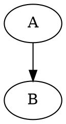

### Rendered

~~~

## Rendering Workflow

### Step 1: Write DOT Source
```python
dot_source = """
digraph G {
    rankdir=LR;
    A -> B -> C;
}
"""
```

### Step 2: Render to Image
```python
import subprocess
from pathlib import Path

def render_graphviz(
    dot_source: str,
    output_path: Path,
    format: str = "png",
    engine: str = "dot"
) -> Path:
    """
    Render DOT source to image file.

    Args:
        dot_source: DOT language source code
        output_path: Output file path (without extension)
        format: Output format (png, svg, pdf)
        engine: Layout engine (dot, neato, fdp, circo, twopi, sfdp)

    Returns:
        Path to rendered image
    """
    output_file = output_path.with_suffix(f".{format}")

    result = subprocess.run(
        [engine, f"-T{format}", "-o", str(output_file)],
        input=dot_source,
        text=True,
        capture_output=True
    )

    if result.returncode != 0:
        raise RuntimeError(f"Graphviz error: {result.stderr}")

    return output_file
```

### Step 3: Embed in Markdown
```python
def create_diagram_markdown(
    name: str,
    dot_source: str,
    image_path: str
) -> str:
    """Create markdown with both source and rendered image."""
    return f"""## Diagram: {name}

### Source
```dot
{dot_source}
```

### Rendered

"""
```

## DOT Language Reference

### Basic Graph Types

#### Directed Graph (digraph)
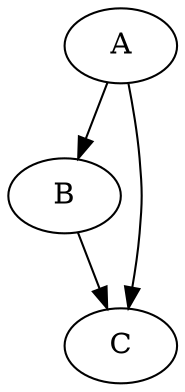

#### Undirected Graph (graph)
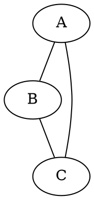

### Graph Attributes

```dot
digraph G {
    // Graph attributes
    rankdir=LR;           // Direction: TB, BT, LR, RL
    splines=ortho;        // Edge style: line, polyline, curved, ortho, spline
    nodesep=0.5;          // Space between nodes
    ranksep=1.0;          // Space between ranks
    bgcolor="white";      // Background color
    fontname="Helvetica"; // Font for labels

    // Nodes and edges
    A -> B;
}
```

### Node Attributes

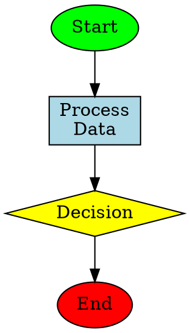

#### Common Node Shapes
| Shape | Use Case |
|-------|----------|
| `box` | Process, action |
| `ellipse` | Start/end, terminal |
| `diamond` | Decision |
| `circle` | State |
| `record` | Structured data |
| `Mrecord` | Rounded record |
| `cylinder` | Database |
| `folder` | Directory/collection |
| `component` | Component |
| `note` | Annotation |

### Edge Attributes

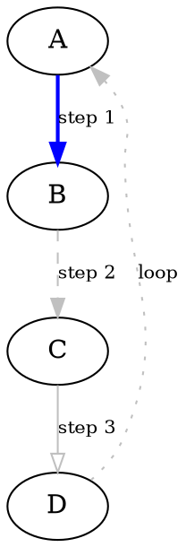

#### Arrow Styles
| Arrowhead | Description |
|-----------|-------------|
| `normal` | Filled triangle (default) |
| `empty` | Open triangle |
| `dot` | Filled circle |
| `odot` | Open circle |
| `diamond` | Filled diamond |
| `none` | No arrowhead |
| `vee` | V-shape |
| `box` | Filled square |

### Subgraphs and Clusters

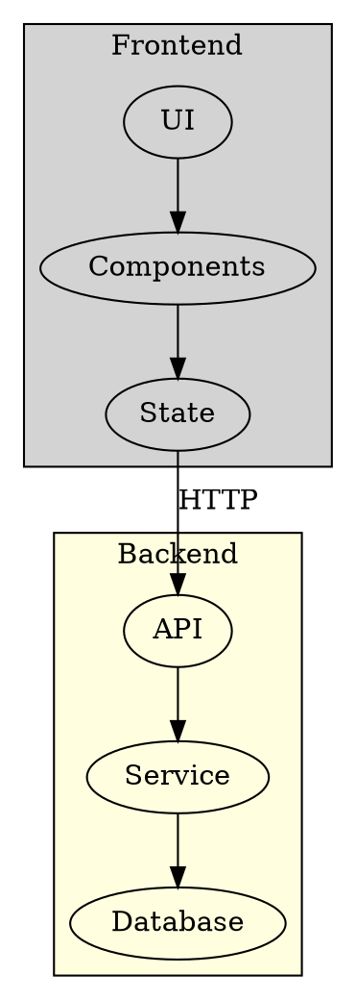

### Records (Structured Nodes)

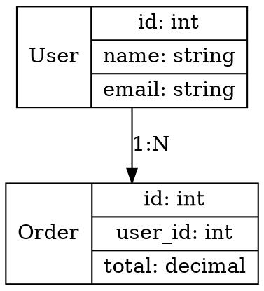

### HTML Labels

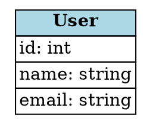

## Layout Engines

| Engine | Best For | Description |
|--------|----------|-------------|
| `dot` | Hierarchies | Directed graphs, trees, DAGs |
| `neato` | Networks | Undirected graphs, spring model |
| `fdp` | Large networks | Force-directed, scalable |
| `sfdp` | Very large | Multiscale force-directed |
| `circo` | Circular | Circular layouts |
| `twopi` | Radial | Radial layouts from root |

### Usage
```bash
# Different engines produce different layouts
dot -Tpng graph.dot -o graph-hierarchical.png
neato -Tpng graph.dot -o graph-spring.png
circo -Tpng graph.dot -o graph-circular.png
```

## Common Patterns

### Dependency Graph
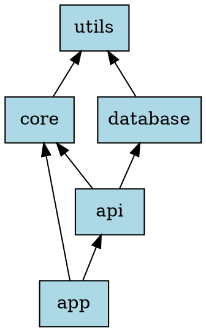

### State Machine
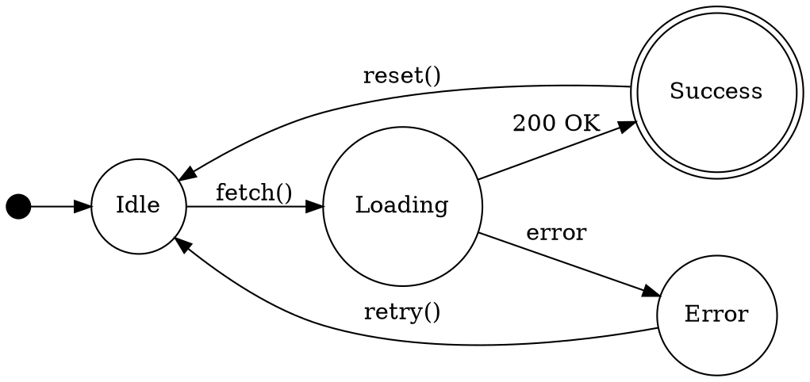

### Call Graph
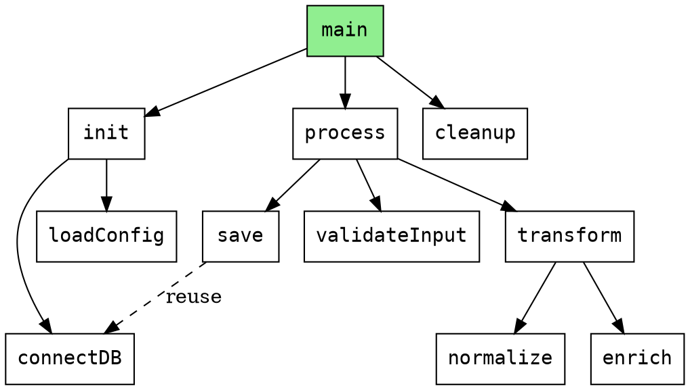

### Network Topology
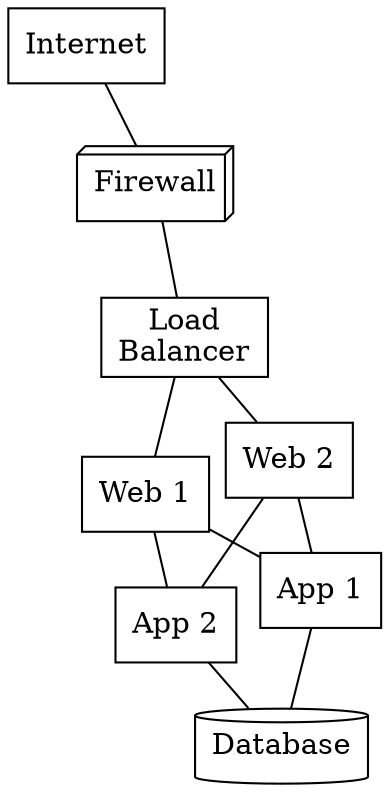

### Entity Relationship
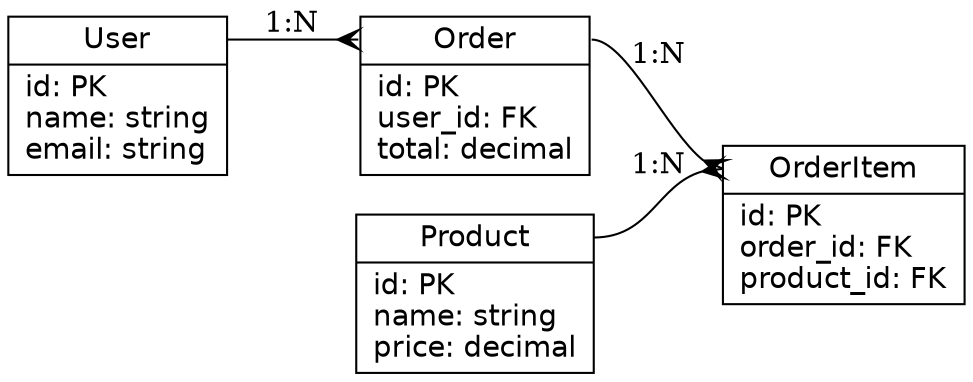

### Flowchart
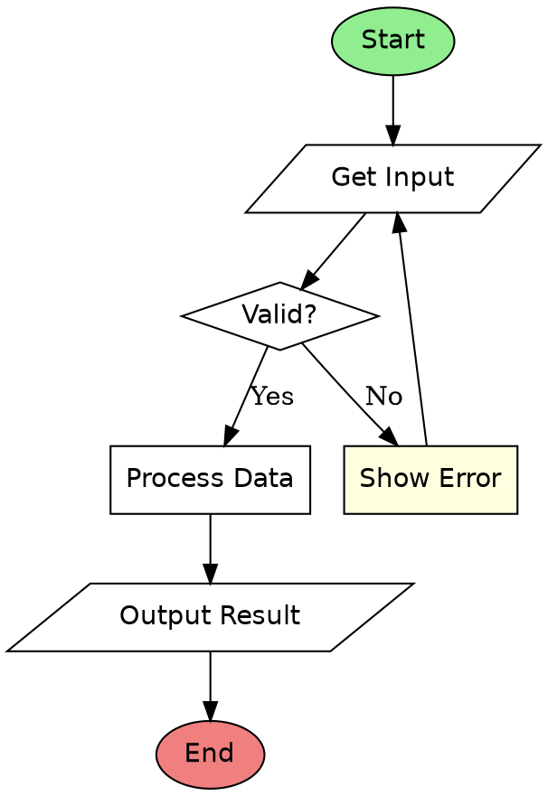

## Integration with Publishers

### Obsidian Integration
```python
def publish_graphviz_to_obsidian(
    vault_path: str,
    folder: str,
    filename: str,
    diagram_name: str,
    dot_source: str
):
    """Publish Graphviz diagram to Obsidian with source and image."""
    from pathlib import Path

    vault = Path(vault_path)
    target_dir = vault / folder
    attachments_dir = vault / "attachments"

    target_dir.mkdir(parents=True, exist_ok=True)
    attachments_dir.mkdir(parents=True, exist_ok=True)

    # Render image
    image_name = f"{filename}-diagram.png"
    image_path = attachments_dir / image_name
    render_graphviz(dot_source, image_path.with_suffix(""), "png")

    # Create markdown with both source and image
    content = f"""# {diagram_name}

## Source

```dot
{dot_source}
```

## Rendered

![[{image_name}]]
"""

    note_path = target_dir / f"{filename}.md"
    note_path.write_text(content)
```

### Joplin Integration
```python
def publish_graphviz_to_joplin(
    notebook: str,
    title: str,
    diagram_name: str,
    dot_source: str
):
    """Publish Graphviz diagram to Joplin with source and image."""
    import tempfile
    from pathlib import Path

    with tempfile.TemporaryDirectory() as tmpdir:
        tmpdir = Path(tmpdir)

        # Render image
        image_path = tmpdir / "diagram.png"
        render_graphviz(dot_source, image_path.with_suffix(""), "png")

        # Create markdown
        content = f"""# {diagram_name}

## Source

```dot
{dot_source}
```

## Rendered


"""

        md_path = tmpdir / f"{title}.md"
        md_path.write_text(content)

        # Import to Joplin (imports markdown and referenced images)
        subprocess.run([
            "joplin", "import", str(tmpdir),
            "--notebook", notebook
        ], check=True)
```

## Graphviz vs Mermaid

| Feature | Graphviz | Mermaid |
|---------|----------|---------|
| **Layout control** | Precise, many engines | Automatic only |
| **Complexity** | Handles very large graphs | Better for simpler diagrams |
| **Rendering** | External tool required | Browser-native |
| **Styling** | Extensive options | Limited but sufficient |
| **Learning curve** | Steeper | Easier |
| **Use case** | Complex dependencies, call graphs | Quick diagrams, sequences |

**Use Graphviz when:**
- You need precise layout control
- Graph is large or complex
- You need specific node arrangements
- Creating dependency or call graphs

**Use Mermaid when:**
- Quick inline diagrams
- Sequence diagrams
- Simple flowcharts
- Native browser rendering preferred

## Prerequisites

### Install Graphviz
```bash
# macOS
brew install graphviz

# Ubuntu/Debian
sudo apt-get install graphviz

# Windows (chocolatey)
choco install graphviz

# Verify installation
dot -V
```

## Checklist

Before creating Graphviz diagrams:
- [ ] Graphviz installed (`dot -V`)
- [ ] Output directory writable
- [ ] DOT syntax validated
- [ ] Appropriate layout engine selected
- [ ] Both source and image included in output
- [ ] Image path correct for target (Obsidian/Joplin)
