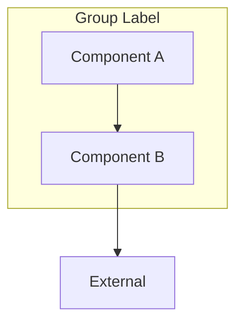
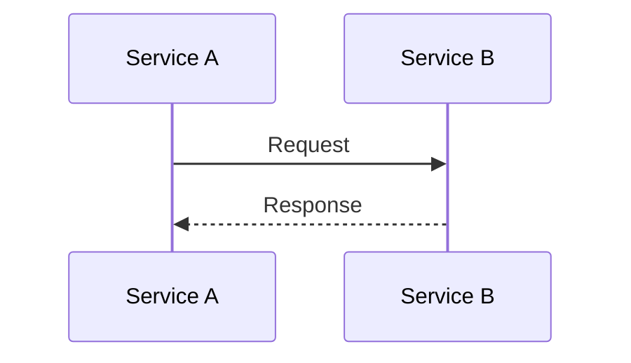

# Image to Diagram Conversion

Convert visual diagrams into editable, version-controllable code.

## Workflow

```
Image → Claude Vision → Mermaid/DOT code → Save → Optionally ingest to Qdrant
```

## Supported Input

| Type | Quality |
|------|---------|
| Screenshots of diagrams | Excellent |
| Architecture tool exports | Excellent |
| Clean whiteboard photos | Good |
| Hand-drawn diagrams | Moderate (clear boxes/arrows help) |
| Low-contrast/blurry images | Poor |

## Output Formats

### Mermaid (default)
- Flowcharts, sequence diagrams, class diagrams, ER diagrams
- Renders in GitHub, GitLab, Notion, VS Code
- File extension: `.mmd` or `.mermaid`

### DOT/Graphviz
- More layout control
- Better for complex graphs
- File extension: `.dot` or `.gv`

## Conversion Process

### 1. Analyze the Image

Read the image and identify:
- Overall structure (hierarchy, flow, network)
- Components/nodes and their labels
- Relationships/connections between components
- Groupings/subgraphs
- Color coding (convert to styles)

### 2. Choose Diagram Type

| Visual Pattern | Mermaid Type |
|----------------|--------------|
| Boxes with arrows (flow) | `flowchart TD/LR` |
| Sequence of interactions | `sequenceDiagram` |
| Classes with relationships | `classDiagram` |
| Database tables | `erDiagram` |
| States and transitions | `stateDiagram-v2` |
| Timeline/phases | `gantt` or `timeline` |
| Hierarchical groups | `flowchart` with `subgraph` |

### 3. Generate Code

**Flowchart template:**


**Sequence diagram template:**


### 4. Apply Styling

Map visual colors to Mermaid styles:

```mermaid
%% Color mapping
style NodeName fill:#hexcolor,stroke:#bordercolor,color:#textcolor

%% Common colors
%% Blue: fill:#2563eb,stroke:#3b82f6,color:#fff
%% Green: fill:#059669,stroke:#10b981,color:#fff
%% Red: fill:#dc2626,stroke:#ef4444,color:#fff
%% Orange: fill:#d97706,stroke:#f59e0b,color:#fff
%% Purple: fill:#7c3aed,stroke:#8b5cf6,color:#fff
```

### 5. Save and Optionally Ingest

```bash
# Save to file
# Write to ~/Desktop/diagram-name.mmd

# Ingest to Qdrant for pattern reuse
/reflex:ingest ~/Desktop/diagram-name.mmd --collection personal_memories
```

## Tips for Best Results

1. **Describe intent**: "Convert this to Mermaid, it shows a microservices architecture"
2. **Specify format**: "Use flowchart with subgraphs" or "Make it a sequence diagram"
3. **Request styling**: "Match the colors from the image" or "Use default styling"
4. **Iterate**: "Add more detail to the auth flow" or "Simplify the database section"

## Example Prompts

```
"Convert this whiteboard photo to Mermaid"

"Turn this architecture diagram into a flowchart with subgraphs"

"Create a sequence diagram from this interaction flow screenshot"

"Convert to Mermaid, save as microservices-arch.mmd, and ingest to Qdrant"
```

## After Conversion

The diagram can be:
- Committed to version control
- Rendered in documentation (GitHub, GitLab, Notion)
- Ingested to Qdrant for semantic search and pattern reuse
- Edited and refined as text
- Used as a template for similar architectures
