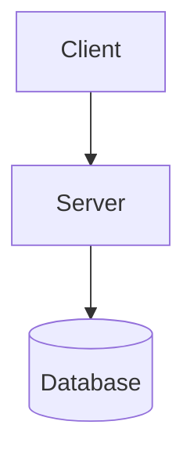
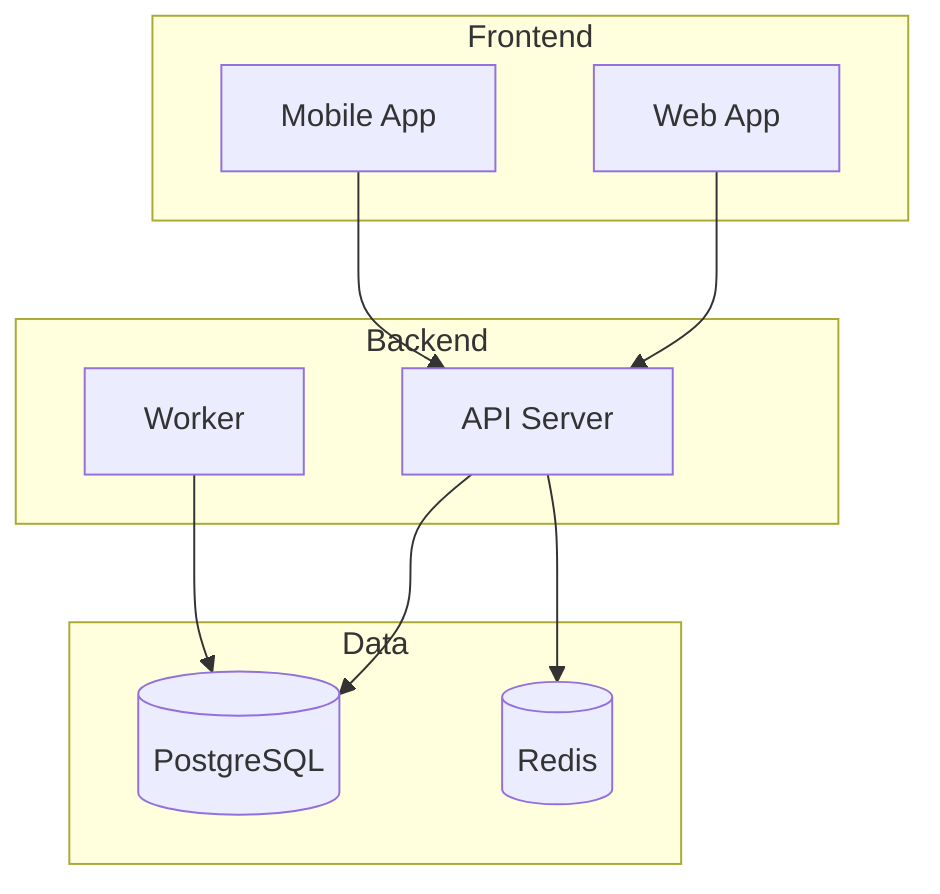

# Joplin Publisher Skill

## Purpose
Import markdown documents and mermaid diagrams into Joplin using the Joplin CLI.

## When to Use
- Exporting research to Joplin notebooks
- Creating documentation in Joplin
- Generating diagrams for Joplin knowledge base
- Syncing analysis results to Joplin

## Overview

Joplin uses a database-backed system. Content is imported via the Joplin CLI or API. This skill focuses on CLI-based imports.

## Prerequisites

### Install Joplin CLI
```bash
# Using npm
npm install -g joplin

# Verify installation
joplin version
```

### Configure Joplin CLI
```bash
# Set sync target (if needed)
joplin config sync.target 2  # Filesystem
joplin config sync.2.path /path/to/sync/folder

# Or connect to Joplin Server/Cloud
joplin config sync.target 9
joplin config sync.9.path https://your-joplin-server.com
joplin config sync.9.username your-username
```

## Joplin CLI Commands

### List Notebooks
```bash
joplin ls /          # List top-level notebooks
joplin ls /Notebook  # List notes in notebook
```

### Create Notebook
```bash
joplin mkbook "Notebook Name"
joplin mkbook "Parent/Child"  # Nested notebook
```

### Import Markdown
```bash
# Import single file to notebook
joplin import /path/to/file.md --notebook "Notebook Name"

# Import directory
joplin import /path/to/folder --notebook "Notebook Name"

# Import with format specification
joplin import /path/to/file.md --format md --notebook "Notebook Name"
```

### Create Note Directly
```bash
# Create note from stdin
echo "# Title

Content" | joplin mknote "Note Title" --notebook "Notebook Name"

# Create from file content
cat file.md | joplin mknote "Note Title" --notebook "Notebook Name"
```

## Publishing Workflow

### Step 1: Validate Notebook Exists
```python
import subprocess

def notebook_exists(notebook: str) -> bool:
    """Check if a Joplin notebook exists."""
    result = subprocess.run(
        ["joplin", "ls", "/"],
        capture_output=True,
        text=True
    )
    notebooks = result.stdout.strip().split('
')
    return notebook in notebooks

def create_notebook_if_missing(notebook: str):
    """Create notebook if it doesn't exist."""
    if not notebook_exists(notebook):
        subprocess.run(
            ["joplin", "mkbook", notebook],
            check=True
        )
```

### Step 2: Prepare Content
```python
def prepare_markdown(
    title: str,
    content: str,
    tags: list = None
) -> str:
    """
    Prepare markdown content for Joplin import.

    Joplin supports YAML frontmatter for metadata.
    """
    lines = [f"# {title}", ""]

    if tags:
        lines.extend([
            "---",
            f"tags: {', '.join(tags)}",
            "---",
            ""
        ])

    lines.append(content)
    return '
'.join(lines)
```

### Step 3: Write Temporary File
```python
import tempfile
from pathlib import Path

def write_temp_markdown(content: str, filename: str) -> Path:
    """Write content to a temporary markdown file."""
    temp_dir = Path(tempfile.mkdtemp())
    file_path = temp_dir / f"{filename}.md"
    file_path.write_text(content, encoding='utf-8')
    return file_path
```

### Step 4: Import to Joplin
```python
def import_to_joplin(
    file_path: Path,
    notebook: str
) -> bool:
    """Import markdown file to Joplin notebook."""
    result = subprocess.run(
        [
            "joplin", "import",
            str(file_path),
            "--notebook", notebook
        ],
        capture_output=True,
        text=True
    )

    if result.returncode != 0:
        raise JoplinImportError(f"Import failed: {result.stderr}")

    return True
```

### Complete Publishing Function
```python
def publish_to_joplin(
    notebook: str,
    title: str,
    content: str,
    tags: list = None
) -> bool:
    """
    Publish markdown content to a Joplin notebook.

    Args:
        notebook: Target notebook name
        title: Note title
        content: Markdown content (can include mermaid)
        tags: Optional list of tags

    Returns:
        True if successful
    """
    # Ensure notebook exists
    create_notebook_if_missing(notebook)

    # Prepare content
    full_content = prepare_markdown(title, content, tags)

    # Write to temp file
    temp_file = write_temp_markdown(full_content, title)

    try:
        # Import to Joplin
        import_to_joplin(temp_file, notebook)
        return True
    finally:
        # Cleanup
        temp_file.unlink()
        temp_file.parent.rmdir()
```

## Document Formats

### Basic Note
```markdown
# Note Title

Content goes here.

## Section

More content.
```

### Note with Tags
```markdown
# Note Title


Content here.
```

### Note with Mermaid
Joplin supports mermaid diagrams natively in markdown:

```markdown
# System Architecture



## Description

The system consists of...
```

## Notebook Organization

### Flat Structure
```
Notebooks/
├── Research
├── Projects
├── Meetings
└── Archive
```

### Nested Structure
```
Notebooks/
├── Work/
│   ├── Project Alpha
│   └── Project Beta
├── Personal/
│   ├── Notes
│   └── Ideas
└── Archive/
```

Create nested notebooks:
```bash
joplin mkbook "Work"
joplin mkbook "Work/Project Alpha"
```

## Usage Examples

### Publish Research Note
```python
publish_to_joplin(
    notebook="Research",
    title="API Design Patterns",
    content="""
## Overview

Key findings from API design research.

## REST Best Practices

1. Use nouns for resources
2. Use HTTP methods correctly
3. Version your API

## GraphQL Considerations

- Schema-first design
- Query optimization
""",
    tags=["api", "research", "design"]
)
```

### Publish Diagram
```python
publish_to_joplin(
    notebook="Architecture",
    title="System Overview Diagram",
    content="""
## Architecture Diagram



## Components

| Component | Technology | Purpose |
|-----------|------------|---------|
| Web App | React | User interface |
| API Server | FastAPI | REST API |
| Worker | Celery | Background jobs |
""",
    tags=["architecture", "diagram"]
)
```

### Publish Meeting Notes
```python
publish_to_joplin(
    notebook="Meetings/2024",
    title="Project Sync - Jan 15",
    content="""
## Attendees
- Alice
- Bob
- Charlie

## Agenda
1. Sprint review
2. Blockers
3. Next steps

## Notes

### Sprint Review
- Feature X completed
- Bug Y in progress

### Blockers
- Waiting on API access

### Action Items
- [ ] Alice: Follow up on API access
- [ ] Bob: Complete bug fix
- [ ] Charlie: Update documentation
""",
    tags=["meeting", "project-alpha"]
)
```

## Batch Import

For importing multiple documents:

```python
def batch_import(
    notebook: str,
    documents: list[dict]
) -> dict:
    """
    Import multiple documents to Joplin.

    Args:
        notebook: Target notebook
        documents: List of {title, content, tags} dicts

    Returns:
        {success: int, failed: int, errors: list}
    """
    results = {"success": 0, "failed": 0, "errors": []}

    for doc in documents:
        try:
            publish_to_joplin(
                notebook=notebook,
                title=doc["title"],
                content=doc["content"],
                tags=doc.get("tags", [])
            )
            results["success"] += 1
        except Exception as e:
            results["failed"] += 1
            results["errors"].append({
                "title": doc["title"],
                "error": str(e)
            })

    return results
```

## Error Handling

```python
class JoplinError(Exception):
    """Base exception for Joplin operations."""
    pass

class JoplinNotInstalledError(JoplinError):
    """Joplin CLI not found."""
    pass

class JoplinImportError(JoplinError):
    """Failed to import content."""
    pass

class NotebookNotFoundError(JoplinError):
    """Notebook does not exist."""
    pass

def check_joplin_installed():
    """Verify Joplin CLI is available."""
    result = subprocess.run(
        ["joplin", "version"],
        capture_output=True
    )
    if result.returncode != 0:
        raise JoplinNotInstalledError(
            "Joplin CLI not found. Install with: npm install -g joplin"
        )
```

## Joplin API Alternative

For more control, use the Joplin Data API:

```python
import requests

class JoplinAPI:
    def __init__(self, token: str, port: int = 41184):
        self.base_url = f"http://localhost:{port}"
        self.token = token

    def create_note(
        self,
        title: str,
        body: str,
        parent_id: str = None
    ) -> dict:
        """Create a note via Joplin API."""
        response = requests.post(
            f"{self.base_url}/notes",
            params={"token": self.token},
            json={
                "title": title,
                "body": body,
                "parent_id": parent_id
            }
        )
        response.raise_for_status()
        return response.json()
```

Enable the API in Joplin Desktop: Options → Web Clipper → Enable

## Checklist

Before publishing:
- [ ] Joplin CLI is installed and configured
- [ ] Target notebook exists or will be created
- [ ] Content is valid markdown
- [ ] Mermaid diagrams use correct syntax
- [ ] Tags are properly formatted
- [ ] Sync is configured (if using cloud/server)
