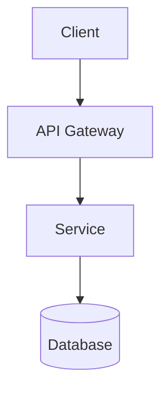
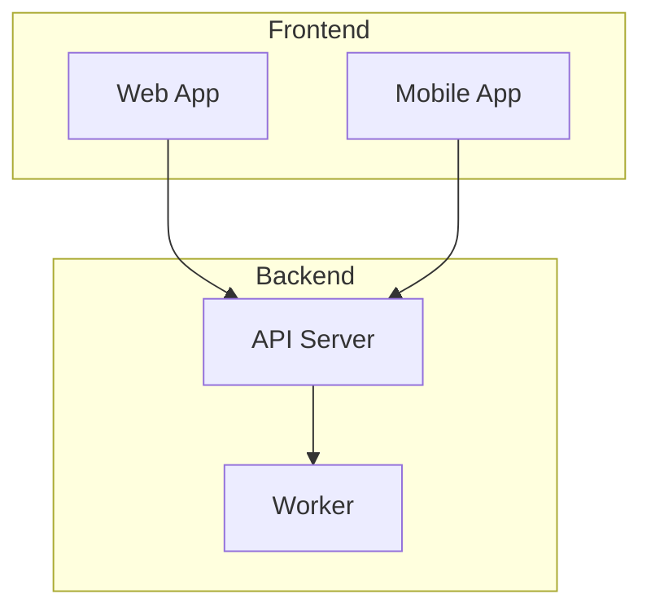
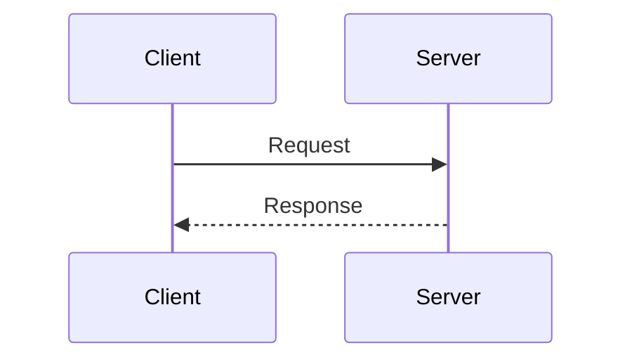

# Obsidian Publisher Skill

## Purpose
Write markdown documents and mermaid diagrams to Obsidian vaults.

## When to Use
- Outputting research notes to Obsidian
- Creating documentation in a vault
- Generating diagrams for knowledge base
- Exporting analysis results

## Overview

Obsidian uses plain markdown files in folder-based vaults. Publishing is simply writing `.md` files to the correct directory.

## Vault Structure

```
vault-path/
├── folder/
│   ├── note.md
│   └── subfolder/
│       └── nested-note.md
├── attachments/        # Optional: for images
└── templates/          # Optional: note templates
```

## Publishing Workflow

### Step 1: Receive Vault Path
The vault path is passed per-request. Validate it exists:

```python
from pathlib import Path

def validate_vault(vault_path: str) -> Path:
    path = Path(vault_path).expanduser().resolve()
    if not path.exists():
        raise ValueError(f"Vault not found: {vault_path}")
    if not path.is_dir():
        raise ValueError(f"Vault path is not a directory: {vault_path}")
    return path
```

### Step 2: Create Document Structure

```python
def create_note(
    vault_path: str,
    folder: str,
    filename: str,
    content: str,
    frontmatter: dict = None
) -> Path:
    """
    Create a note in an Obsidian vault.

    Args:
        vault_path: Path to Obsidian vault
        folder: Subfolder within vault (can be nested like "projects/2024")
        filename: Note filename (without .md extension)
        content: Markdown content
        frontmatter: Optional YAML frontmatter dict

    Returns:
        Path to created file
    """
    vault = validate_vault(vault_path)
    target_dir = vault / folder
    target_dir.mkdir(parents=True, exist_ok=True)

    # Sanitize filename
    safe_filename = sanitize_filename(filename)
    file_path = target_dir / f"{safe_filename}.md"

    # Build content with optional frontmatter
    full_content = build_content(content, frontmatter)

    file_path.write_text(full_content, encoding='utf-8')
    return file_path
```

### Step 3: Format Content

```python
def build_content(content: str, frontmatter: dict = None) -> str:
    """Build markdown content with optional YAML frontmatter."""
    if frontmatter:
        import yaml
        fm_str = yaml.dump(frontmatter, default_flow_style=False)
        return f"---
{fm_str}---

{content}"
    return content

def sanitize_filename(name: str) -> str:
    """Remove or replace invalid filename characters."""
    invalid_chars = '<>:"/\|?*'
    for char in invalid_chars:
        name = name.replace(char, '-')
    return name.strip()
```

## Document Formats

### Basic Note
```markdown
# Title

Content goes here.

## Section

More content.
```

### Note with Frontmatter
```markdown

# My Note

Content here.
```

### Note with Mermaid Diagram
```markdown
# System Architecture

## Overview

This document describes the system architecture.

## Diagram



## Components

### API Gateway
Handles routing and authentication.
```

### Note with Internal Links
```markdown
# Project Overview

This project uses [[Architecture|the architecture]] defined elsewhere.

Related:
- [[API Design]]
- [[Database Schema]]

See also: [[projects/2024/related-project|Related Project]]
```

## Frontmatter Patterns

### Research Note
```yaml
```

### Meeting Note
```yaml
```

### Documentation
```yaml
```

### Diagram Document
```yaml
```

## Folder Organization Patterns

### By Type
```
vault/
├── notes/
├── research/
├── diagrams/
├── meetings/
└── projects/
```

### By Date
```
vault/
├── 2024/
│   ├── 01-january/
│   └── 02-february/
└── archive/
```

### By Project
```
vault/
├── project-alpha/
│   ├── research/
│   ├── design/
│   └── notes/
└── project-beta/
```

## Usage Examples

### Publish Research Note
```python
create_note(
    vault_path="~/Documents/Obsidian/MyVault",
    folder="research",
    filename="API Design Patterns",
    content="""
# API Design Patterns

## REST Best Practices

Key findings from research...

## GraphQL Considerations

...
""",
    frontmatter={
        "title": "API Design Patterns",
        "date": "2024-01-15",
        "tags": ["api", "research"],
        "status": "draft"
    }
)
```

### Publish Diagram
```python
create_note(
    vault_path="~/Documents/Obsidian/MyVault",
    folder="diagrams/architecture",
    filename="System Overview",
    content="""
# System Overview



## Components

- **Web App**: React-based SPA
- **Mobile App**: React Native
- **API Server**: FastAPI
- **Worker**: Celery
""",
    frontmatter={
        "title": "System Overview",
        "diagram_type": "architecture",
        "tags": ["diagram", "architecture"]
    }
)
```

## Integration with Mermaid

Obsidian renders mermaid diagrams natively. Use `documentation-generator:mermaid-expert` for diagram syntax, then embed directly:

```markdown

```

## Obsidian-Specific Features

### Callouts
```markdown
> [!note]
> This is a note callout

> [!warning]
> This is a warning

> [!tip]
> This is a tip
```

### Tags
```markdown
#tag-name
```

Or in frontmatter:
```yaml
tags:
  - tag1
  - tag2
```

### Internal Links
```markdown
[[Note Name]]
[[folder/Note Name]]
[[Note Name|Display Text]]
[[Note Name#Heading]]
```

### Embeds
```markdown
![[Note to embed]]
![[image.png]]
![[Note#Section]]
```

## Error Handling

```python
class ObsidianPublishError(Exception):
    """Base exception for Obsidian publishing errors."""
    pass

class VaultNotFoundError(ObsidianPublishError):
    """Vault path does not exist."""
    pass

class InvalidFilenameError(ObsidianPublishError):
    """Filename contains invalid characters."""
    pass
```

## Checklist

Before publishing:
- [ ] Vault path is valid and accessible
- [ ] Filename is sanitized
- [ ] Folder structure created
- [ ] Frontmatter is valid YAML
- [ ] Mermaid diagrams use correct syntax
- [ ] Internal links reference existing notes (if applicable)
